# xumux

**Transport-agnostic channel multiplexing protocol**

Version: 0.1.0-draft | Status: Draft | Date: 2026-02-14

---

## What is xumux?

xumux (pronounced zuh-mux) is an open protocol for multiplexing typed, named channels over any reliable or semi-reliable transport. It provides a standard binary framing format, channel lifecycle management, and handshake procedure that works identically whether the underlying transport is a WebRTC DataChannel, a WebSocket, a TCP socket, or a Unix pipe.

Think of it as **a universal way to run multiple logical channels over a single connection** — with each channel having its own reliability and ordering guarantees.

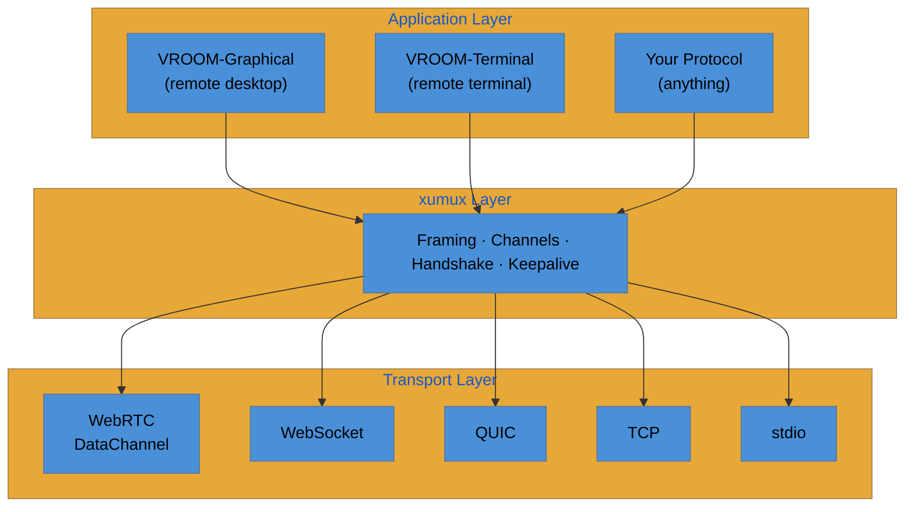

## Design Goals

- **Transport-agnostic**: Same frame format and semantics over any transport
- **Minimal overhead**: 6-byte header for the common case, extensible when needed
- **Channel-native**: First-class support for named, typed channels with independent reliability
- **Simple to implement**: Any language, any platform, in an afternoon
- **Composable**: Application protocols build on top — xumux doesn't define what you send, just how you multiplex it

## Non-Goals

- Defining application-level message semantics (that's your protocol's job)
- Transport negotiation (the transport is already established when xumux starts)
- Encryption (the transport provides this — DTLS for WebRTC, TLS for WebSocket/TCP)

---

## Core Specification

### Magic Number

On stream-oriented transports (TCP, stdio) where there is no protocol negotiation at the transport level, implementations MUST send 4 magic bytes before the first xumux frame:

```
0x4F 0x4D 0x55 0x58  ("OMUX")
```

The receiver MUST validate these 4 bytes. If they don't match, the connection MUST be closed immediately — the remote side does not speak xumux.

On message-oriented transports (WebSocket, WebRTC DataChannel) where protocol identification happens at the transport level (e.g., WebSocket subprotocol header, DataChannel protocol field), the magic number MUST NOT be sent.

On QUIC/WebTransport, the magic number MUST NOT be sent (protocol is identified via ALPN/URL).

### Frame Format

All xumux messages use a 6-byte header followed by an optional payload:

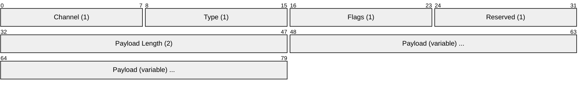

| Offset | Field | Size | Description |
|--------|-------|------|-------------|
| 0 | Channel | 1 byte | Logical channel ID (`0x00` = control channel) |
| 1 | Type | 1 byte | Message type (scoped to channel — type `0x01` on channel 0 means HELLO, type `0x01` on channel 3 means whatever the app defines) |
| 2 | Flags | 1 byte | Bitfield (see below) |
| 3 | Reserved | 1 byte | MUST be `0x00` |
| 4 | Payload Length | 2 bytes | Big-endian. Max 65,535 bytes. |
| 6 | Payload | variable | Message-specific data |

#### Flags

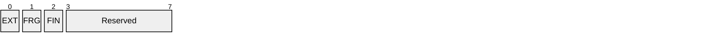

| Bit | Name | Description |
|-----|------|-------------|
| 0 | `EXTENDED_LENGTH` | Payload Length is 4 bytes instead of 2 (header becomes 8 bytes, max ~4GB) |
| 1 | `FRAGMENT` | This message is a fragment of a larger message |
| 2 | `FRAGMENT_END` | This is the last fragment |
| 3-7 | Reserved | MUST be 0 |

**Standard frame (6 bytes header):**
```
[Channel:1][Type:1][Flags:1][Rsv:1][Length:2][Payload:0-65535]
```

**Extended frame (8 bytes header, EXTENDED_LENGTH flag set):**
```
[Channel:1][Type:1][Flags:1][Rsv:1][Length:4][Payload:0-4294967295]
```

#### Fragmentation

Messages larger than the transport's MTU (or the negotiated max message size) MUST be fragmented:

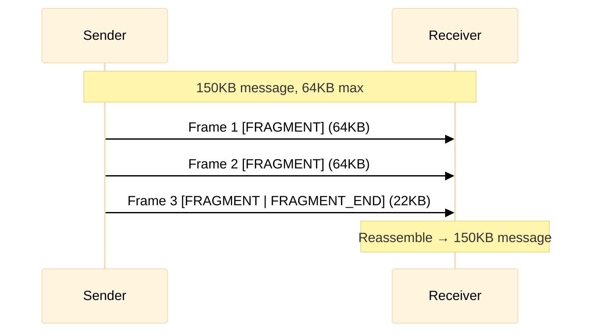

All fragments MUST have the same Channel, Type, and be delivered in order on that channel. The receiver reassembles until it sees `FRAGMENT_END`.

**Restrictions**:
- Fragmentation MUST NOT be used on channels declared as `unordered` or `unreliable`. Out-of-order or lost fragments cannot be reassembled.
- Fragmentation MUST NOT be used on QUIC datagrams (see QUIC binding).
- Only one fragmented message may be in-flight per channel at a time. Interleaving fragments from different messages on the same channel is a protocol error.

---

### Channel 0x00: Control Channel

Channel 0 is **always** the control channel. It is implicitly open — never needs OPEN_CHANNEL. It carries all xumux protocol messages.

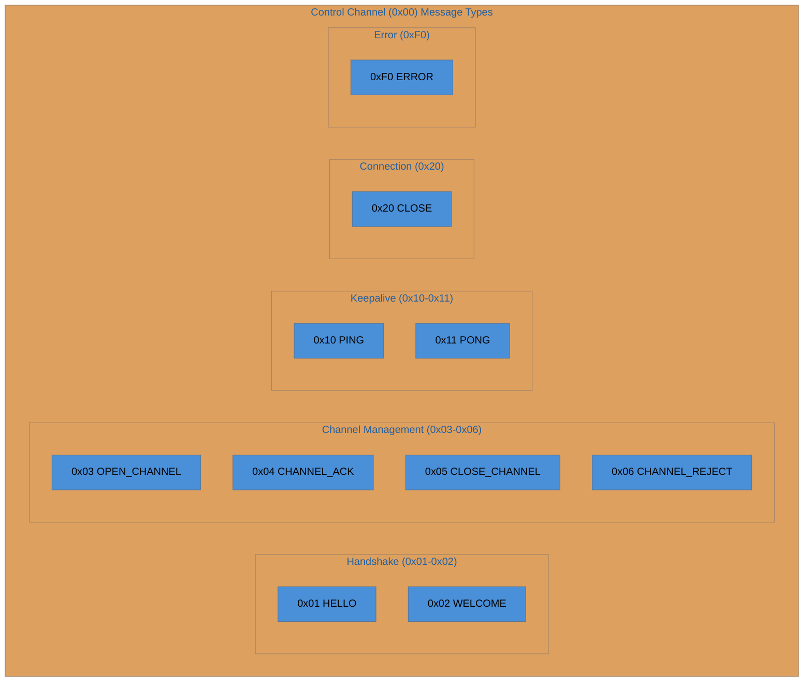

| Type | Name | Direction | Description |
|------|------|-----------|-------------|
| `0x01` | HELLO | C→S | Client initiates connection |
| `0x02` | WELCOME | S→C | Server accepts connection |
| `0x03` | OPEN_CHANNEL | Both | Request to open a new channel |
| `0x04` | CHANNEL_ACK | Both | Channel opened successfully |
| `0x05` | CLOSE_CHANNEL | Both | Close an existing channel |
| `0x06` | CHANNEL_REJECT | Both | Refuse a channel open request |
| `0x10` | PING | Both | Keepalive request |
| `0x11` | PONG | Both | Keepalive response |
| `0x20` | CLOSE | Both | Graceful connection close |
| `0xF0` | ERROR | Both | Error notification |

---

### Connection Lifecycle

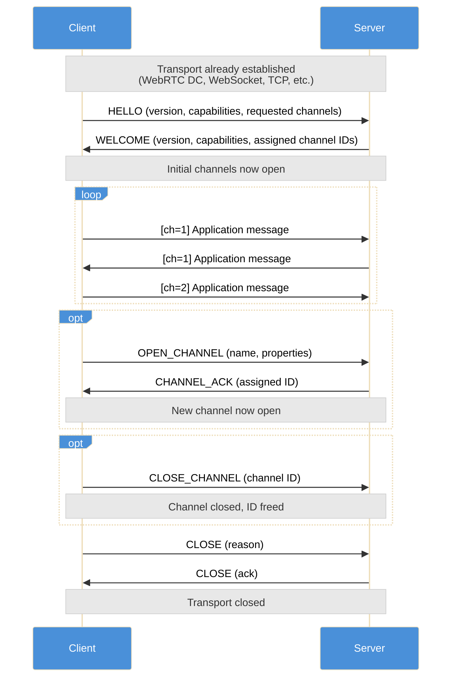

---

### Message Specifications

#### HELLO (0x01) — Client → Server

The first message after transport establishment. MUST be sent by the client.

> **Encoding convention**: All control channel (0x00) messages with variable-length payloads use **JSON (UTF-8)**. This keeps the control plane human-readable and debuggable. Application channels (1-254) use whatever encoding the application protocol defines (typically binary for hot-path events, JSON for control).
>
> The only non-JSON control messages are PING and PONG, which use fixed-size binary payloads for efficiency.

```json
{
  "version": [0, 1, 0],
  "application": "vroom/0.1",
  "extensions": ["fragmentation"],
  "maxMessageSize": 65535,
  "pingInterval": 30,
  "pingTimeout": 10,
  "channels": [
    {
      "name": "pointer",
      "reliable": false,
      "ordered": false,
      "maxRetransmits": 0
    },
    {
      "name": "button",
      "reliable": true,
      "ordered": true
    }
  ],
  "auth": {
    "type": "token",
    "token": "eyJhbGciOi..."
  }
}
```

| Field | Type | Required | Description |
|-------|------|----------|-------------|
| `version` | `[major, minor, patch]` | MUST | Protocol version. Current: `[0, 1, 0]` |
| `application` | string | SHOULD | Application protocol name and version |
| `extensions` | string[] | MAY | Requested extensions |
| `maxMessageSize` | number | MAY | Max payload bytes. Default: 65535. 0 = no limit. |
| `pingInterval` | number | MAY | Keepalive interval in seconds. Default: 30. 0 = disabled. |
| `pingTimeout` | number | MAY | Seconds to wait for PONG before disconnect. Default: 10. |
| `channels` | Channel[] | MAY | Application channels to open during handshake. **Do NOT include the control channel** — channel 0 is always implicit. |
| `auth` | object | MAY | Authentication credentials |

**Channel object:**

| Field | Type | Required | Description |
|-------|------|----------|-------------|
| `name` | string | MUST | Channel name. Must be unique per connection. |
| `reliable` | boolean | MUST | Whether delivery is guaranteed |
| `ordered` | boolean | MUST | Whether messages arrive in order |
| `maxRetransmits` | number | MAY | Max retransmission attempts (0 = fire-and-forget) |
| `maxPacketLifeTime` | number | MAY | Max milliseconds to attempt delivery |
| `metadata` | object | MAY | Application-specific channel metadata |

#### WELCOME (0x02) — Server → Client

Sent in response to HELLO. Payload is JSON (UTF-8).

```json
{
  "version": [0, 1, 0],
  "extensions": ["fragmentation"],
  "maxMessageSize": 65535,
  "pingInterval": 30,
  "pingTimeout": 10,
  "channels": [
    {"name": "pointer", "id": 1},
    {"name": "button", "id": 2}
  ]
}
```

| Field | Type | Required | Description |
|-------|------|----------|-------------|
| `version` | `[major, minor, patch]` | MUST | Server's protocol version |
| `extensions` | string[] | MAY | Accepted extensions (intersection of client request) |
| `maxMessageSize` | number | MAY | Negotiated max message size (min of both sides) |
| `pingInterval` | number | MAY | Negotiated ping interval |
| `pingTimeout` | number | MAY | Negotiated ping timeout |
| `channels` | AssignedChannel[] | MUST | Channels with assigned numeric IDs |

**AssignedChannel object:**

| Field | Type | Description |
|-------|------|-------------|
| `name` | string | Channel name (matches request) |
| `id` | number | Assigned channel ID (1-254). Used in frame Channel byte. |

**Channel ID 0** is always the control channel (implicit, never listed in HELLO/WELCOME). Server assigns IDs 1-254 to application channels. ID 255 is reserved.

#### Handshake Rejection

If the server cannot accept the connection (authentication failed, version incompatible, application unsupported), it MUST respond with a **CLOSE** message instead of WELCOME:

```json
{
  "code": 4000,
  "reason": "Authentication failed"
}
```

The client MUST treat receiving CLOSE instead of WELCOME as a rejected handshake.

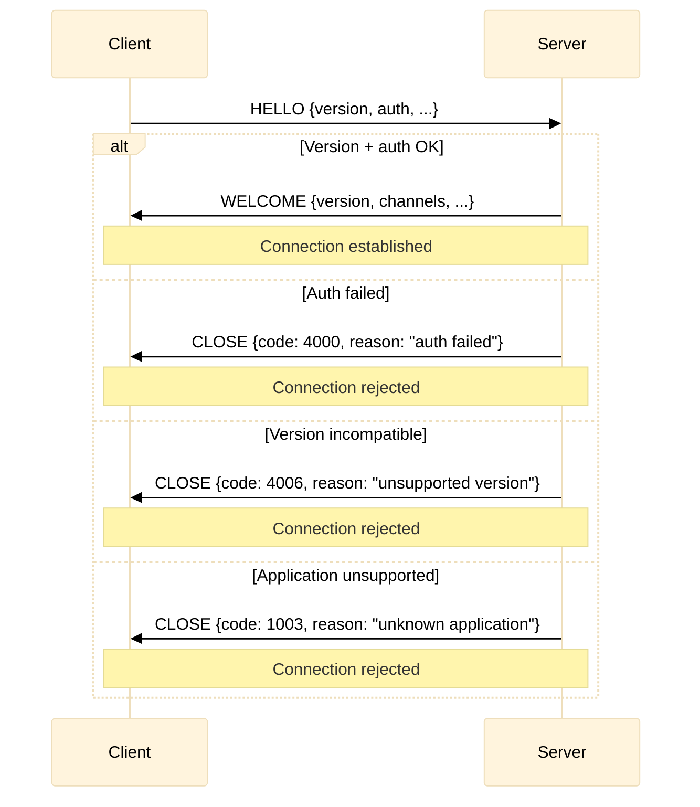

#### Version Negotiation

The client sends its version in HELLO. The server responds in WELCOME with its own version. Compatibility rules:

- **Major version mismatch**: Server MUST reject with CLOSE code `4006` (VERSION_MISMATCH). Major versions are not backward-compatible.
- **Minor version mismatch**: Server SHOULD accept. The effective protocol version is the minimum of both minor versions. Features from higher minor versions MUST NOT be used.
- **Patch version mismatch**: Always compatible. Informational only.

#### HELLO Timeout

Servers MUST enforce a timeout for receiving HELLO after transport establishment. Default: **10 seconds**. If no HELLO is received, the server MUST close the transport.

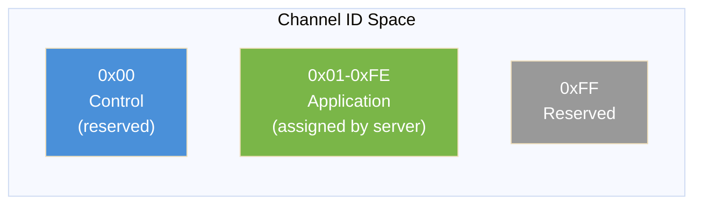

#### OPEN_CHANNEL (0x03) — Bidirectional

Dynamically open a new channel after the handshake. Sent on channel 0. Payload is JSON (UTF-8).

```json
{
  "requestId": 1,
  "name": "file-transfer",
  "reliable": true,
  "ordered": true,
  "metadata": {
    "direction": "upload",
    "filename": "document.pdf"
  }
}
```

| Field | Type | Required | Description |
|-------|------|----------|-------------|
| `requestId` | number | MUST | Unique request ID for correlating with ACK/REJECT |
| `name` | string | MUST | Channel name. Must be unique per connection. |
| `reliable` | boolean | MUST | Delivery guarantee |
| `ordered` | boolean | MUST | Ordering guarantee |
| `maxRetransmits` | number | MAY | Max retransmit attempts |
| `maxPacketLifeTime` | number | MAY | Max delivery time in ms |
| `metadata` | object | MAY | Application-specific metadata |

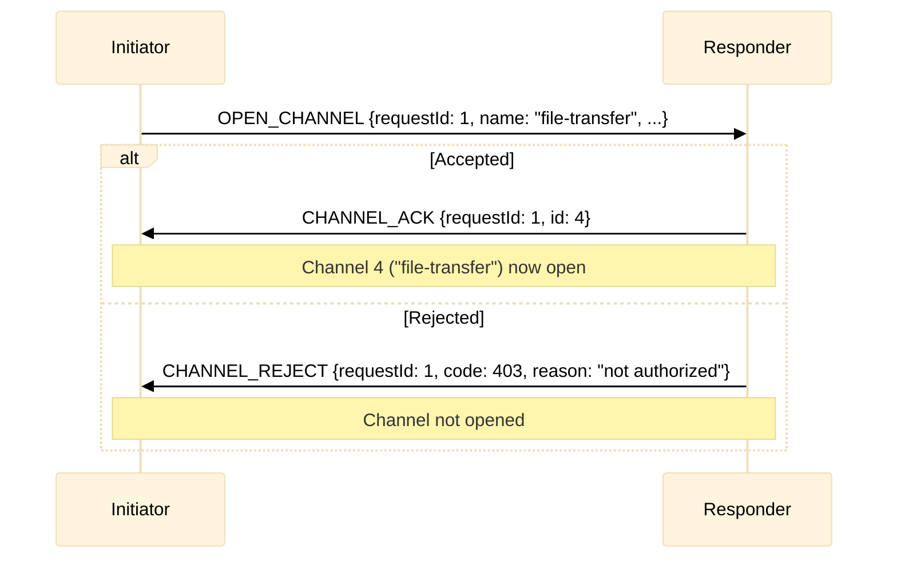

#### CHANNEL_ACK (0x04) — Bidirectional

Confirms a channel was opened. Sent on channel 0. Payload is JSON (UTF-8).

```json
{
  "requestId": 1,
  "id": 4,
  "name": "file-transfer"
}
```

| Field | Type | Required | Description |
|-------|------|----------|-------------|
| `requestId` | number | MUST | Matches the OPEN_CHANNEL requestId |
| `id` | number | MUST | Assigned channel ID (1-254) |
| `name` | string | MUST | Channel name (echoed back for clarity) |

After CHANNEL_ACK, both sides MAY immediately send messages on the new channel ID.

#### CHANNEL_REJECT (0x06) — Bidirectional

Refuses a channel open request. Sent on channel 0. Payload is JSON (UTF-8).

```json
{
  "requestId": 1,
  "code": 403,
  "reason": "Channel type not supported"
}
```

| Field | Type | Required | Description |
|-------|------|----------|-------------|
| `requestId` | number | MUST | Matches the OPEN_CHANNEL requestId |
| `code` | number | MUST | Error code (see Error Codes) |
| `reason` | string | SHOULD | Human-readable reason |

#### CLOSE_CHANNEL (0x05) — Bidirectional

Close an existing channel. Sent on channel 0. Payload is JSON (UTF-8).

```json
{
  "id": 4,
  "reason": "transfer complete"
}
```

| Field | Type | Required | Description |
|-------|------|----------|-------------|
| `id` | number | MUST | Channel ID to close |
| `reason` | string | MAY | Human-readable reason |

After CLOSE_CHANNEL, the channel ID is **freed** and MAY be reused for future OPEN_CHANNEL requests. Both sides MUST stop sending on the channel immediately. Any in-flight messages on the closed channel SHOULD be discarded.

**Guard**: CLOSE_CHANNEL MUST NOT be sent for channel 0. The control channel can only be closed via CLOSE (which closes the entire connection). Implementations receiving CLOSE_CHANNEL for channel 0 MUST respond with ERROR code 1002 (PROTOCOL_ERROR).

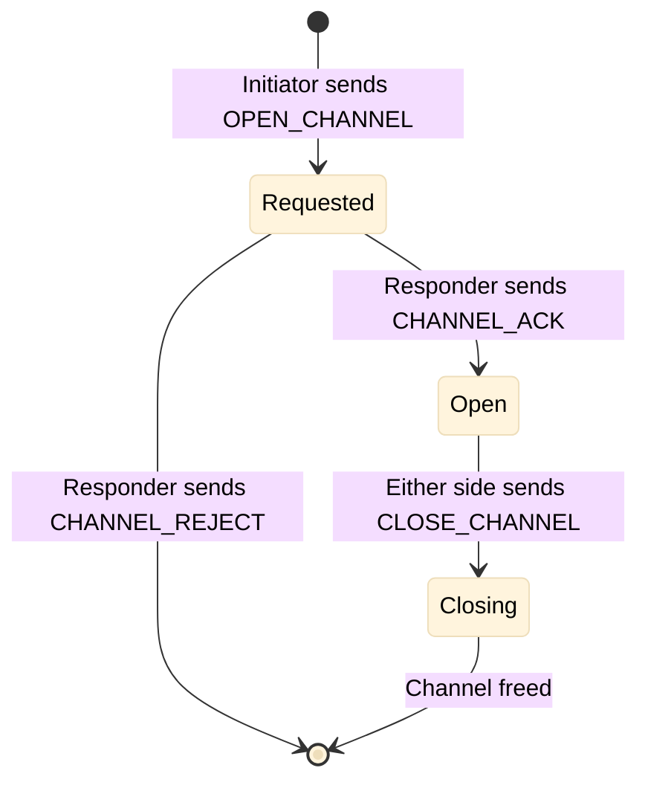

#### PING (0x10) — Bidirectional

Keepalive probe. Sent on channel 0. Payload:

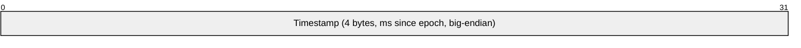

| Field | Size | Description |
|-------|------|-------------|
| Timestamp | 4 bytes | Milliseconds since connection established (big-endian, wraps at ~49 days) |

The receiver MUST respond with PONG containing the same timestamp.

#### PONG (0x11) — Bidirectional

Keepalive response. Sent on channel 0. Payload:

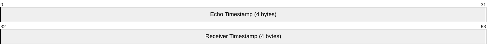

| Field | Size | Description |
|-------|------|-------------|
| Echo Timestamp | 4 bytes | Copied from PING |
| Receiver Timestamp | 4 bytes | Receiver's current timestamp |

This allows both sides to compute round-trip time: `RTT = local_now - echo_timestamp`.

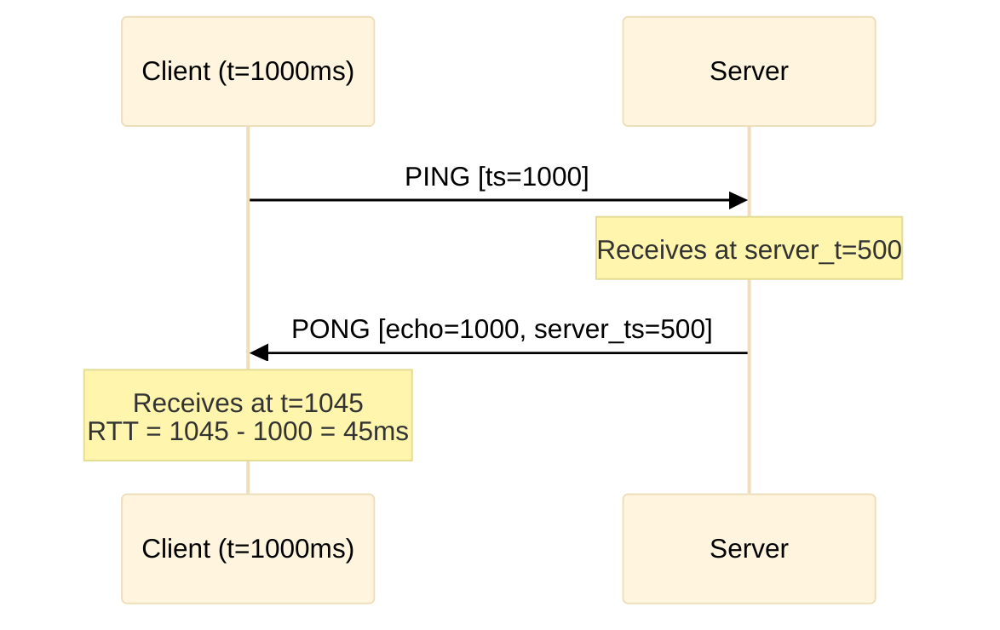

#### CLOSE (0x20) — Bidirectional

Graceful connection close. Sent on channel 0. Payload is JSON (UTF-8).

```json
{
  "code": 1000,
  "reason": "session ended"
}
```

| Field | Type | Required | Description |
|-------|------|----------|-------------|
| `code` | number | MUST | Close code (see Close Codes) |
| `reason` | string | MAY | Human-readable reason |

The side that receives CLOSE SHOULD respond with its own CLOSE (ack), then both sides close the transport.

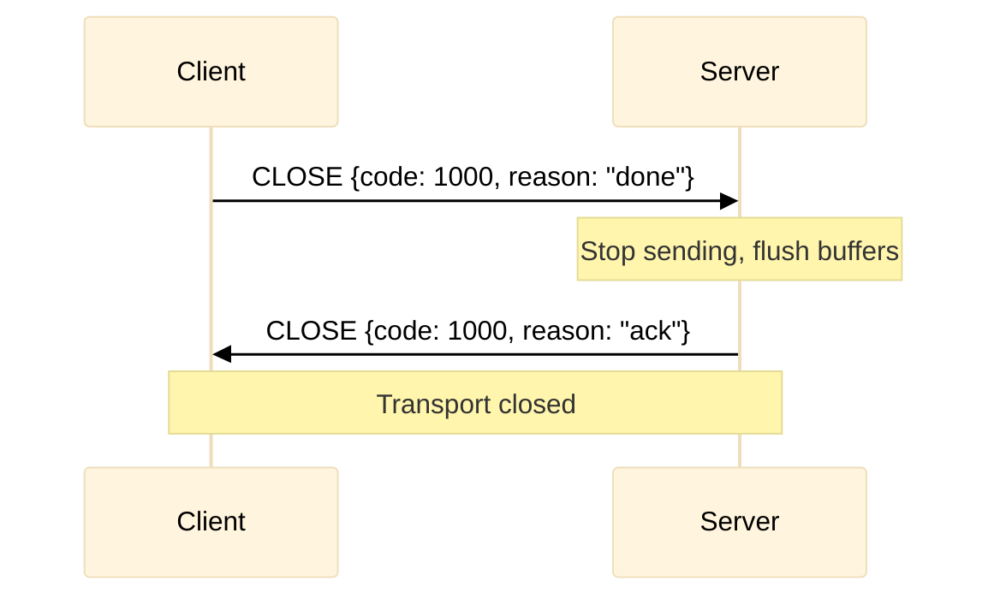

#### ERROR (0xF0) — Bidirectional

Non-fatal error notification. Sent on channel 0. Payload is JSON (UTF-8).

```json
{
  "code": 4001,
  "channel": 3,
  "reason": "Invalid message type 0x99 on channel 3"
}
```

| Field | Type | Required | Description |
|-------|------|----------|-------------|
| `code` | number | MUST | Error code |
| `channel` | number | MAY | Channel the error relates to (omit for connection-level errors) |
| `reason` | string | SHOULD | Human-readable description |

Errors are informational — they do NOT close the connection or channel unless paired with a CLOSE or CLOSE_CHANNEL.

---

### Error Codes

Codes 1000-1003 are intentionally aligned with [WebSocket close codes (RFC 6455)](https://www.rfc-editor.org/rfc/rfc6455#section-7.4.1) for consistency. When closing a WebSocket transport, implementations SHOULD send an xumux CLOSE first, then close the WebSocket with code 1000 (normal). The xumux close code carries the application-level reason; the WebSocket close code is always 1000 (or 1001 for going away).

| Code | Name | Description |
|------|------|-------------|
| 1000 | NORMAL | Normal closure |
| 1001 | GOING_AWAY | Endpoint shutting down |
| 1002 | PROTOCOL_ERROR | Protocol violation |
| 1003 | UNSUPPORTED | Unsupported message type or feature |
| 4000 | AUTH_FAILED | Authentication failed |
| 4001 | INVALID_MESSAGE | Malformed message |
| 4002 | CHANNEL_FULL | Max channels (254) reached |
| 4003 | CHANNEL_NOT_FOUND | Message on unknown channel ID |
| 4004 | RATE_LIMITED | Too many messages |
| 4005 | MESSAGE_TOO_LARGE | Payload exceeds negotiated max |
| 4006 | VERSION_MISMATCH | Incompatible protocol version |
| 4007 | HELLO_TIMEOUT | No HELLO received within timeout |
| 4100-4999 | Application-defined | Reserved for application protocols |

---

### Negotiation

Parameters are negotiated during HELLO/WELCOME:

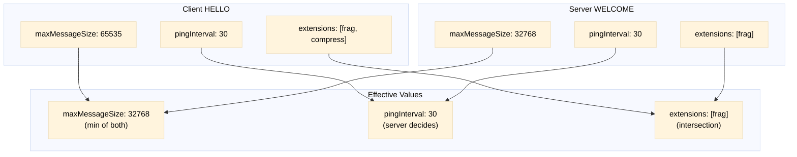

| Parameter | Negotiation Rule |
|-----------|-----------------|
| `maxMessageSize` | Minimum of both values |
| `pingInterval` | Server's value wins |
| `pingTimeout` | Server's value wins |
| `extensions` | Intersection of both sets |

---

### Transport Mapping

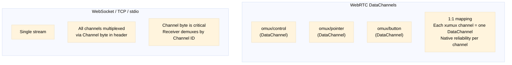

When the transport natively supports multiple channels (WebRTC DataChannels), xumux channels MAY map 1:1 to transport channels. Each DataChannel is labeled `omux/<channel-name>`. The Channel byte in the frame header is redundant but MUST still be present for format consistency and gateway bridging.

When the transport is a single stream (WebSocket, TCP, stdio), all channels are multiplexed over that stream using the Channel byte.

---

## Transport Bindings

| Transport | Specification | Primary/Fallback |
|-----------|---------------|-----------------|
| QUIC / WebTransport | [xumux-on-quic.md](docs/xumux-on-quic.md) | **Optimal** (when available) |
| WebRTC DataChannel | [xumux-on-webrtc.md](docs/xumux-on-webrtc.md) | **Primary** (universal browser support) |
| WebSocket | [xumux-on-websocket.md](docs/xumux-on-websocket.md) | Fallback |
| TCP | [xumux-on-tcp.md](docs/xumux-on-tcp.md) | Server-to-server |
| stdio | [xumux-on-stdio.md](docs/xumux-on-stdio.md) | Process IPC |

## Application Protocols

xumux is a multiplexing layer. Application protocols define what flows over the channels:

| Protocol | Description | Repository |
|----------|-------------|------------|
| **VROOM-Graphical** | Virtual Remoting Over xumux — WebRTC video/audio + interactive browser control for AI agents | [github.com/visionik/vroom](https://github.com/visionik/vroom) |
|| **VROOM-Terminal** | Terminal I/O transport (tunnel + PTY modes) — successor to SocketPipe | (this repo, `docs/app-termpipe.md`) |

## Test Vectors

Reference hex dumps for implementors to validate parsers. All multi-byte values are big-endian.

### PING (timestamp = 1000ms)

```
00 10 00 00 00 04 00 00 03 E8
│  │  │  │  ├──┘ ├────────┘
│  │  │  │  │    └─ Payload: uint32 1000 (0x000003E8)
│  │  │  │  └─ Length: 4
│  │  │  └─ Reserved: 0x00
│  │  └─ Flags: 0x00
│  └─ Type: 0x10 (PING)
└─ Channel: 0x00 (control)
```

**Hex**: `00 10 00 00 00 04 00 00 03 E8`

### PONG (echo = 1000ms, receiver = 500ms)

```
00 11 00 00 00 08 00 00 03 E8 00 00 01 F4
│  │  │  │  ├──┘ ├────────┘  ├────────┘
│  │  │  │  │    │            └─ Receiver timestamp: 500
│  │  │  │  │    └─ Echo timestamp: 1000
│  │  │  │  └─ Length: 8
│  │  └─ Flags: 0x00
│  └─ Type: 0x11 (PONG)
└─ Channel: 0x00 (control)
```

**Hex**: `00 11 00 00 00 08 00 00 03 E8 00 00 01 F4`

### MOUSE_MOVE on pointer channel (id=1, x=512, y=300)

```
01 01 00 00 00 04 02 00 01 2C
│  │  │  │  ├──┘ ├──┘  ├──┘
│  │  │  │  │    │      └─ Y: 300 (0x012C)
│  │  │  │  │    └─ X: 512 (0x0200)
│  │  │  │  └─ Length: 4
│  │  └─ Flags: 0x00
│  └─ Type: 0x01 (MOUSE_MOVE, app-defined)
└─ Channel: 0x01 (pointer)
```

**Hex**: `01 01 00 00 00 04 02 00 01 2C`

### HELLO (minimal)

```
Payload (JSON, UTF-8):
{"version":[0,1,0],"channels":[]}

Frame header:
00 01 00 00 00 22
│  │  │  │  ├──┘
│  │  │  │  └─ Length: 34 (0x0022)
│  │  └─ Flags: 0x00
│  └─ Type: 0x01 (HELLO)
└─ Channel: 0x00

Full frame hex:
00 01 00 00 00 22 7B 22 76 65 72 73 69 6F 6E 22 3A 5B 30 2C 31 2C 30 5D 2C 22 63 68 61 6E 6E 65 6C 73 22 3A 5B 5D 7D
```

### Magic Number (TCP/stdio only)

```
4F 4D 55 58
│  │  │  │
O  M  U  X
```

Sent once, before the first frame. Not an xumux frame — just 4 raw bytes.

---

## Conformance Levels

### Minimal Implementation

A minimal xumux implementation MUST support:

- Channel 0 (control) only — no application channels
- HELLO / WELCOME (handshake)
- CLOSE (graceful shutdown)
- ERROR (error reporting)
- Standard frame format (6-byte header)
- One transport binding

A minimal implementation MAY omit:
- PING / PONG (keepalive)
- OPEN_CHANNEL / CHANNEL_ACK / CHANNEL_REJECT / CLOSE_CHANNEL (dynamic channels)
- Fragmentation (FRAGMENT / FRAGMENT_END flags)
- EXTENDED_LENGTH flag
- Magic number (if not using TCP/stdio)

### Full Implementation

A full xumux implementation MUST support everything in minimal, plus:

- Dynamic channels (OPEN_CHANNEL / CHANNEL_ACK / CHANNEL_REJECT / CLOSE_CHANNEL)
- PING / PONG with RTT measurement
- Fragmentation
- EXTENDED_LENGTH
- Magic number on stream transports
- HELLO timeout enforcement
- Version negotiation
- At least two transport bindings

---

## Prior Art

xumux evolved from [SocketPipe](https://github.com/visionik/socketpipe), originally designed for terminal I/O over WebSocket. The core framing and protocol concepts were generalized into a transport-agnostic multiplexing layer.

Related projects studied during design:
- **n.eko** — JSON over WebSocket for remote desktop control
- **Selkies-GStreamer** — CSV over WebRTC DataChannel for remote desktop
- **JetKVM** — Binary over WebRTC DataChannel for hardware KVM

## License

MIT
