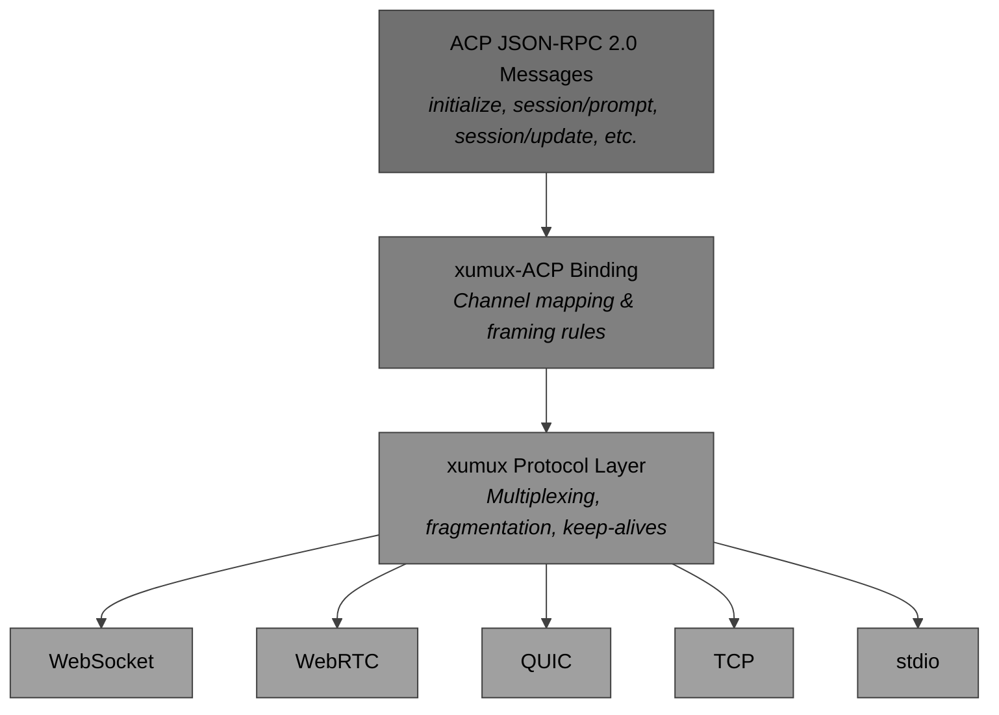
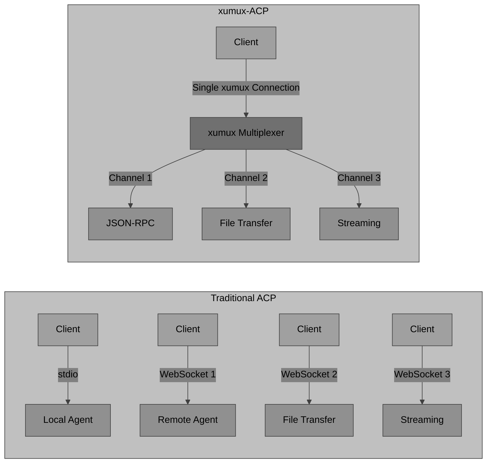
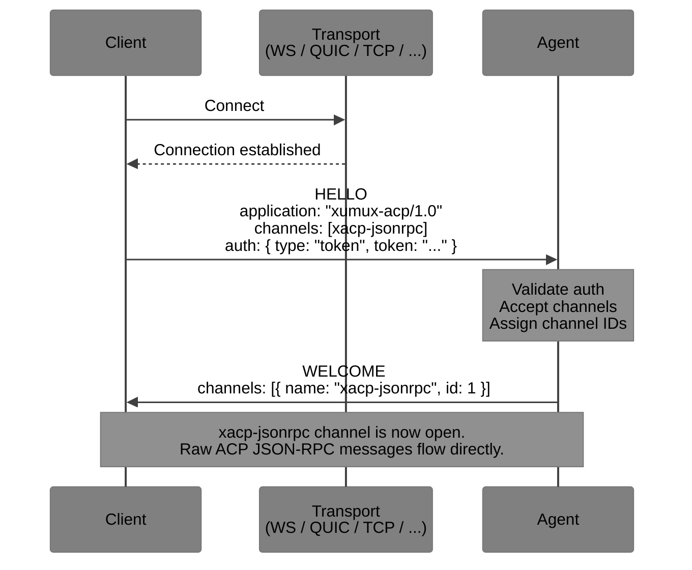
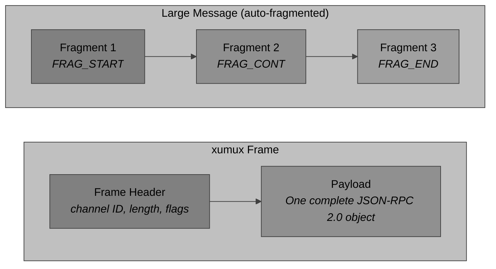
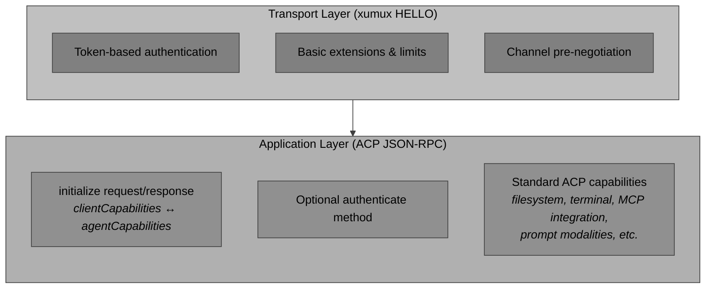
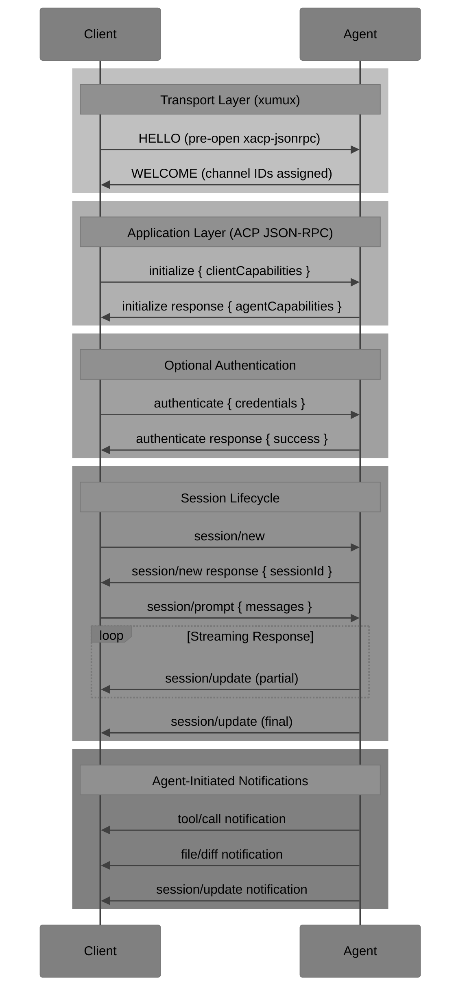
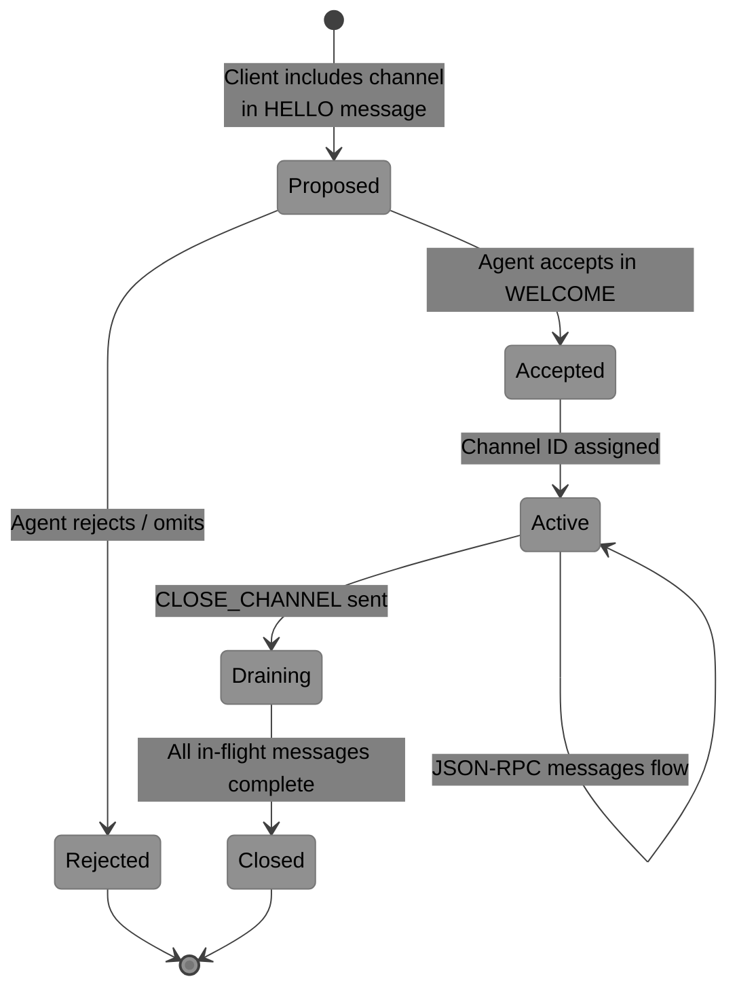
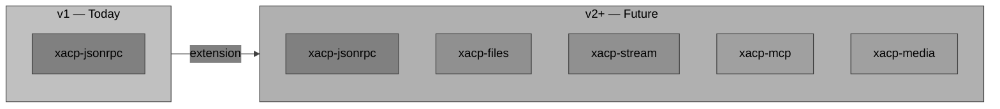
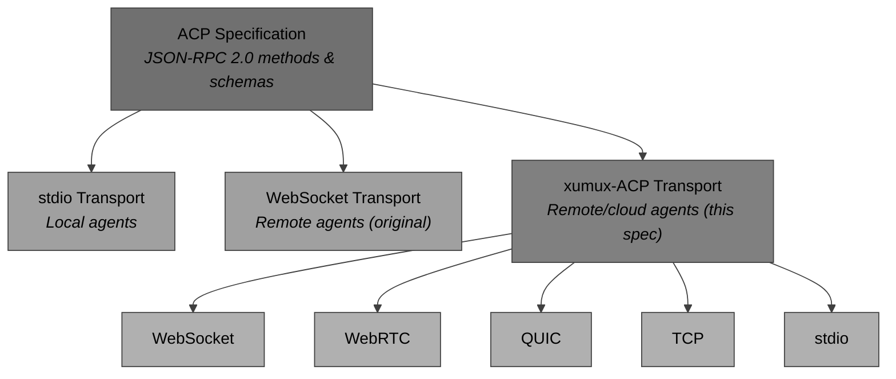

# xumux-ACP: Agent Client Protocol over xumux

**Version:** 1.0 (Draft)
**Status:** Proposed extension
**Published:** <https://xumux.org/acp>
**Repository:** <https://github.com/deftai/xumux>

xumux-ACP defines how the [Agent Client Protocol (ACP)](https://agentclientprotocol.com/) runs natively over [xumux](https://github.com/deftai/xumux) — the eXtensible Universal MUltipleXer.

It keeps the **exact same JSON-RPC 2.0** messages and semantics from the official ACP specification while using xumux for transport, multiplexing, framing, and negotiation. This makes remote/cloud agents fast, reliable, and transport-agnostic (WebSocket, WebRTC, QUIC, TCP, stdio, etc.).

## Architecture Overview



## Motivation

Traditional ACP transports (stdio for local, raw WebSocket for remote) have limitations:

- One connection per feature is messy
- No built-in fragmentation or multiplexing
- Inconsistent behavior across local vs remote
- Extra glue code for keepalives, auth, etc.



xumux-ACP solves this with a single efficient connection that supports multiple logical channels while staying fully compatible with ACP's JSON-RPC layer.

Existing ACP implementations continue to work unchanged via stdio. A thin xumux wrapper can bridge them when needed.

## Core Principles

- JSON-RPC 2.0 payloads remain **unchanged** (all ACP methods, notifications, and schemas stay identical).
- xumux handles framing, multiplexing, fragmentation, keep-alives, and transport abstraction.
- Channels are pre-negotiated in the xumux HELLO for minimal latency.
- Two-layer capability model: transport-level (xumux HELLO) + application-level (ACP `initialize`).

## Negotiation

xumux-ACP uses **pre-opening channels in the HELLO** message (recommended for lowest latency).

### Recommended Channels (v1)

| Channel Name            | Reliable | Ordered | Purpose                                    | Key Metadata                               |
|-------------------------|----------|---------|--------------------------------------------|--------------------------------------------||
| `xacp-jsonrpc`          | Yes      | Yes     | All JSON-RPC 2.0 ACP messages              | `protocol`, `acpVersion`, `maxMessageSize` |
| `xacp-files` (optional) | Yes      | Yes     | Large file reads/writes and binary content | `maxChunkSize`                             |

Future channels (e.g. `xacp-stream`) can be added later.

### Negotiation Flow



### Client HELLO Example

```json
{
  "version": [0, 1, 0],
  "application": "xumux-acp/1.0",
  "extensions": ["xacp-jsonrpc"],
  "auth": {
    "type": "token",
    "token": "eyJhbGciOiJIUzI1NiIsInR5cCI6IkpXVCJ9..."
  },
  "channels": [
    {
      "name": "xacp-jsonrpc",
      "reliable": true,
      "ordered": true,
      "metadata": {
        "protocol": "jsonrpc-2.0",
        "acpVersion": 1,
        "maxMessageSize": 67108864
      }
    }
  ]
}
```

The agent responds with a **WELCOME** message that accepts the requested channels and assigns concrete channel IDs.

After a successful WELCOME, both sides immediately start exchanging raw ACP JSON-RPC messages on the assigned channel for `xacp-jsonrpc`. No extra envelope is used — each xumux frame carries exactly one complete JSON-RPC 2.0 object.

## Framing Rules



- Messages on `xacp-jsonrpc` **MUST** be valid ACP JSON-RPC 2.0 objects (request, response, or notification).
- xumux automatically handles fragmentation for large messages.
- JSON-RPC `id` fields and error codes work exactly as in the original ACP specification.
- xumux-level channel errors and JSON-RPC errors coexist.

## Authentication and Capabilities

xumux-ACP uses a **two-layer capability model** to cleanly separate transport concerns from application logic.



This ensures full compatibility with the official ACP specification.

## Conformance Requirements

A compliant xumux-ACP implementation **MUST**:

1. Correctly implement the xumux protocol.
2. Pre-open at least the `xacp-jsonrpc` channel during HELLO/WELCOME.
3. Send and receive unmodified ACP JSON-RPC messages on that channel.
4. Respect capabilities from both transport and application layers.
5. Handle xumux keep-alives, fragmentation, and errors properly.

## Example Message Flow



All JSON-RPC traffic uses the single multiplexed xumux channel.

## Channel Lifecycle



## Future Extensions

- **Additional pre-opened channels** — `xacp-files`, `xacp-stream`
- **Dynamic channel creation** — via `OPEN_CHANNEL`
- **Native binary message types** — for higher performance
- **Built-in MCP tool server multiplexing**
- **Multimodal channels** — voice, image



## Relationship to Original ACP

xumux-ACP is **not** a competing protocol. It is a **transport binding** for ACP. The JSON-RPC layer stays identical.

You can still use original ACP over stdio or raw WebSocket. xumux-ACP simply provides a better wire format for modern use cases, especially remote and cloud agents.



## References

- [Agent Client Protocol](https://agentclientprotocol.com/)
- [ACP Protocol Details & Schema](https://agentclientprotocol.com/protocol)
- [xumux Specification](https://github.com/deftai/xumux)
- [JSON-RPC 2.0](https://www.jsonrpc.org/specification)

## Contributing

This specification lives in the xumux repository under the `docs/` directory.

We welcome:

- Editor integrations (VS Code, Zed, JetBrains, etc.)
- Agent-side SDKs (Go, Python, TypeScript, Rust)
- Conformance test suite and example implementations
- Feedback and PRs
