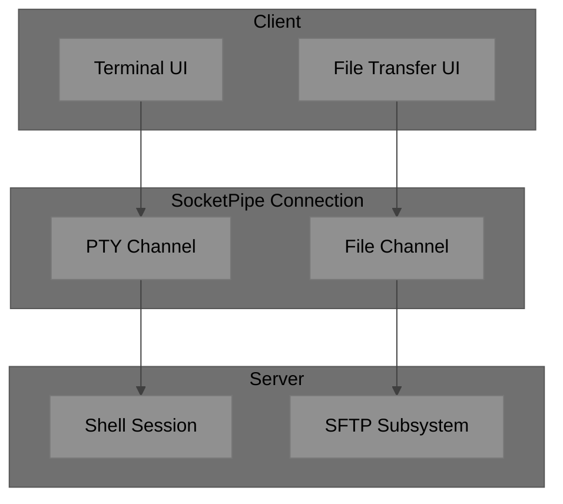
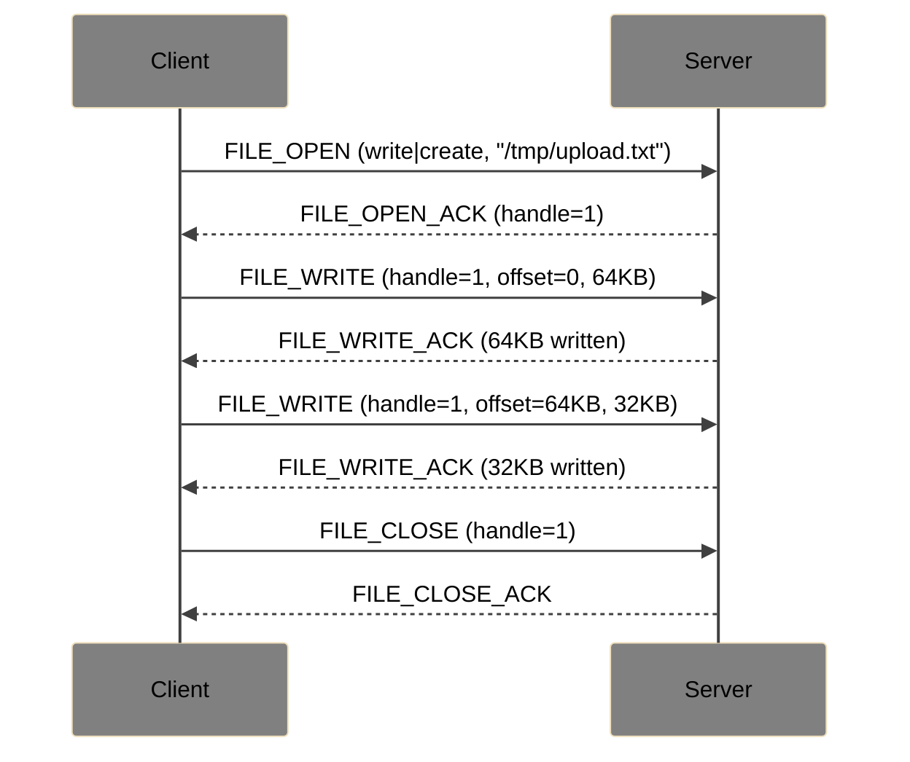
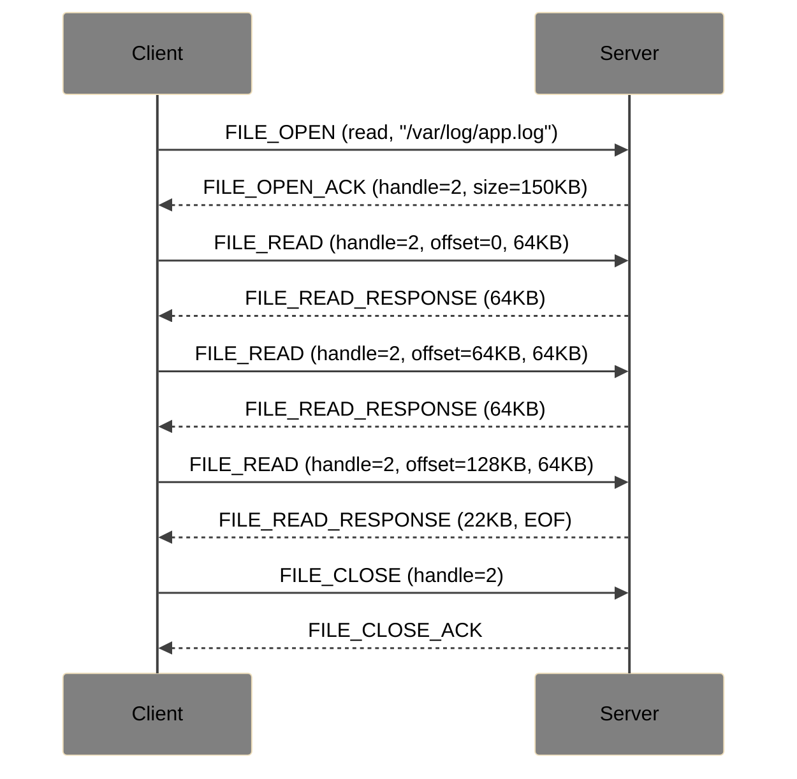

# SocketPipe Extension: File Transfer

**Status**: Draft  
**Extension ID**: `file-transfer`  
**Depends on**: Core Protocol v1.0

## Overview

File Transfer enables SCP/SFTP-like file operations over SocketPipe connections. Files can be transferred without interrupting the terminal session.

## Use Cases

- Upload configuration files to remote server
- Download logs or output files
- Drag-and-drop file transfer in web terminals
- Scripted file synchronization

## Architecture

## Protocol Changes

### Capability Negotiation

**Flags** (byte 1 of header):
- Bit 4: `1` = File Transfer supported

### New Message Types

| Type | Name | Direction | Description |
| --- | --- | --- | --- |
| `0x80` | FILE_OPEN | C→S | Open file for read/write |
| `0x81` | FILE_OPEN_ACK | S→C | File opened, handle assigned |
| `0x82` | FILE_READ | C→S | Read from file |
| `0x83` | FILE_READ_RESPONSE | S→C | File data |
| `0x84` | FILE_WRITE | C→S | Write to file |
| `0x85` | FILE_WRITE_ACK | S→C | Write confirmed |
| `0x86` | FILE_CLOSE | C→S | Close file handle |
| `0x87` | FILE_CLOSE_ACK | S→C | File closed |
| `0x88` | FILE_LIST | C→S | List directory |
| `0x89` | FILE_LIST_RESPONSE | S→C | Directory listing |
| `0x8A` | FILE_STAT | C→S | Get file info |
| `0x8B` | FILE_STAT_RESPONSE | S→C | File metadata |
| `0x8C` | FILE_MKDIR | C→S | Create directory |
| `0x8D` | FILE_REMOVE | C→S | Delete file/directory |
| `0x8E` | FILE_RENAME | C→S | Rename/move file |
| `0x8F` | FILE_ACK | S→C | Generic success acknowledgment |

### FILE_OPEN (0x80)

**Payload**:

| Field | Size | Description |
| --- | --- | --- |
| Flags | 1 byte | Open mode flags |
| Path Length | 2 bytes | Length of path |
| Path | variable | File path (UTF-8) |

**Flags**:
- Bit 0: Read
- Bit 1: Write
- Bit 2: Create
- Bit 3: Truncate
- Bit 4: Append
- Bit 5: Exclusive (fail if exists)

### FILE_OPEN_ACK (0x81)

**Flags**:
- Bit 0: `1` = Success, `0` = Failure

**Success Payload**:

| Field | Size | Description |
| --- | --- | --- |
| Handle | 4 bytes | File handle for subsequent operations |
| File Size | 8 bytes | Size in bytes (-1 if unknown/stream) |

**Failure Payload**:

| Field | Size | Description |
| --- | --- | --- |
| Error Code | 2 bytes | Error code |
| Message Length | 1 byte | Length of message |
| Message | variable | Error description |

### FILE_READ (0x82)

**Payload**:

| Field | Size | Description |
| --- | --- | --- |
| Handle | 4 bytes | File handle |
| Offset | 8 bytes | Byte offset to read from |
| Length | 4 bytes | Bytes to read (max 64KB) |

### FILE_READ_RESPONSE (0x83)

**Flags**:
- Bit 0: `1` = Success, `0` = Failure
- Bit 1: `1` = EOF reached

**Success Payload**:

| Field | Size | Description |
| --- | --- | --- |
| Handle | 4 bytes | File handle |
| Data Length | 4 bytes | Actual bytes returned |
| Data | variable | File data |

### FILE_WRITE (0x84)

**Payload**:

| Field | Size | Description |
| --- | --- | --- |
| Handle | 4 bytes | File handle |
| Offset | 8 bytes | Byte offset to write at |
| Data Length | 4 bytes | Bytes to write |
| Data | variable | Data to write |

### FILE_WRITE_ACK (0x85)

**Flags**:
- Bit 0: `1` = Success, `0` = Failure

**Payload**:

| Field | Size | Description |
| --- | --- | --- |
| Handle | 4 bytes | File handle |
| Bytes Written | 4 bytes | Actual bytes written |

### FILE_LIST (0x88)

**Payload**:

| Field | Size | Description |
| --- | --- | --- |
| Path Length | 2 bytes | Length of path |
| Path | variable | Directory path (UTF-8) |

### FILE_LIST_RESPONSE (0x89)

**Payload**:

| Field | Size | Description |
| --- | --- | --- |
| Entry Count | 2 bytes | Number of entries |
| Entries | variable | Array of file entries |

**File Entry**:

| Field | Size | Description |
| --- | --- | --- |
| Name Length | 2 bytes | Length of filename |
| Name | variable | Filename (UTF-8) |
| Type | 1 byte | 0=file, 1=dir, 2=symlink |
| Size | 8 bytes | Size in bytes |
| Modified | 8 bytes | Unix timestamp |
| Permissions | 4 bytes | Unix permissions |

## Upload Flow

## Download Flow

## Error Codes

| Code | Name | Description |
| --- | --- | --- |
| 6000 | FILE_NOT_FOUND | File does not exist |
| 6001 | PERMISSION_DENIED | Insufficient permissions |
| 6002 | FILE_EXISTS | File exists (exclusive create) |
| 6003 | NOT_A_DIRECTORY | Path is not a directory |
| 6004 | IS_A_DIRECTORY | Path is a directory (expected file) |
| 6005 | DISK_FULL | No space left on device |
| 6006 | INVALID_HANDLE | Unknown file handle |
| 6007 | IO_ERROR | General I/O error |

## Security Considerations

- Server MUST enforce filesystem permissions
- Server SHOULD restrict paths to user's home or allowed directories
- Server MAY implement quota limits
- Large transfers SHOULD be resumable (client tracks offset)
- Concurrent file operations on same handle: undefined behavior
