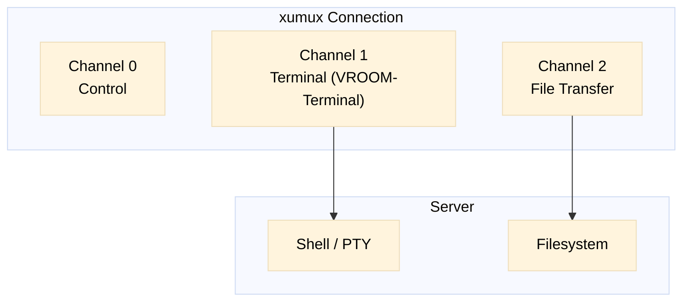
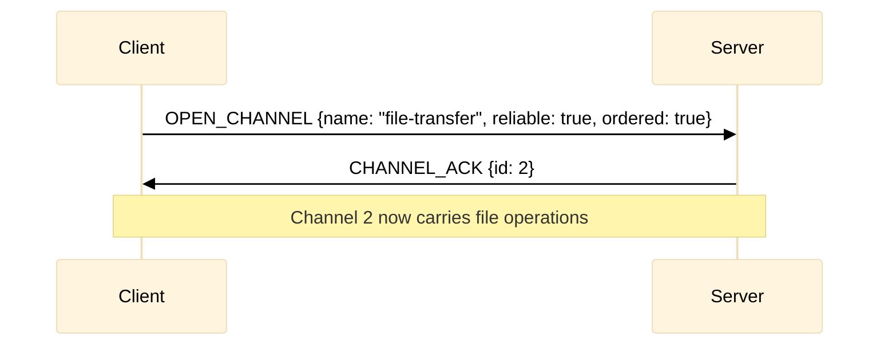
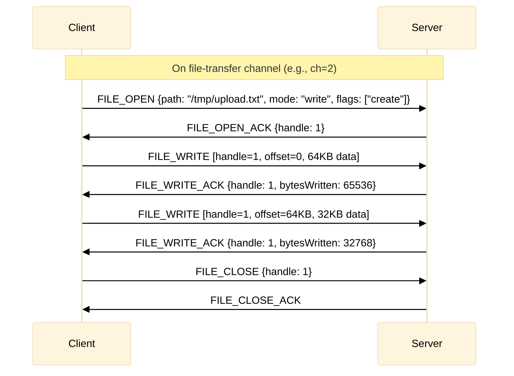
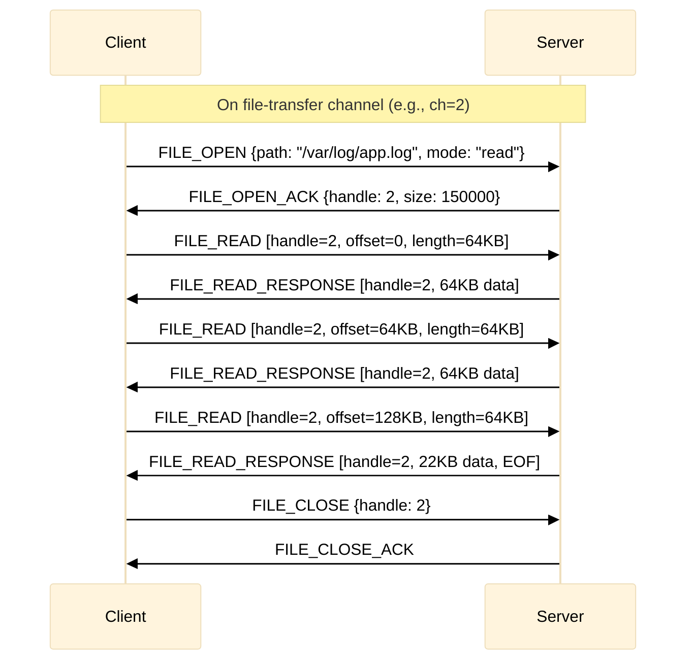

# xumux Extension: File Transfer

**Status**: Draft
**Extension ID**: `file-transfer`
**Depends on**: xumux 0.1.0+

## Overview

File Transfer enables SCP/SFTP-like file operations over an xumux connection. Files are transferred on a dedicated channel without interrupting other channels (e.g., terminal sessions).

## Use Cases

- Upload configuration files to remote server
- Download logs or output files
- Drag-and-drop file transfer in web terminals
- Scripted file synchronization

## Architecture

File transfer uses xumux's native channel multiplexing. A dedicated reliable, ordered channel is opened for file operations, running alongside any other application channels.



## Channel Setup

File transfer uses a dynamically opened channel:



Alternatively, the file-transfer channel can be requested in the initial HELLO `channels` array.

## Application Messages (on file-transfer channel)

All messages below are sent on the assigned file-transfer channel (not channel 0). Message types are scoped to this channel.

| Type | Name | Direction | Description |
|------|------|-----------|-------------|
| `0x01` | FILE_OPEN | C→S | Open file for read/write |
| `0x02` | FILE_OPEN_ACK | S→C | File opened, handle assigned |
| `0x03` | FILE_READ | C→S | Read from file |
| `0x04` | FILE_READ_RESPONSE | S→C | File data |
| `0x05` | FILE_WRITE | C→S | Write to file |
| `0x06` | FILE_WRITE_ACK | S→C | Write confirmed |
| `0x07` | FILE_CLOSE | C→S | Close file handle |
| `0x08` | FILE_CLOSE_ACK | S→C | File closed |
| `0x09` | FILE_LIST | C→S | List directory |
| `0x0A` | FILE_LIST_RESPONSE | S→C | Directory listing |
| `0x0B` | FILE_STAT | C→S | Get file info |
| `0x0C` | FILE_STAT_RESPONSE | S→C | File metadata |
| `0x0D` | FILE_MKDIR | C→S | Create directory |
| `0x0E` | FILE_REMOVE | C→S | Delete file/directory |
| `0x0F` | FILE_RENAME | C→S | Rename/move file |
| `0x10` | FILE_ERROR | S→C | File operation error |

> **Note**: Type numbers are scoped to the file-transfer channel. Type `0x01` on this channel means FILE_OPEN, not HELLO. This is how xumux works — message types are channel-scoped.

### FILE_OPEN (0x01)

**Payload** (JSON):
```json
{
  "path": "/tmp/upload.txt",
  "mode": "write",
  "flags": ["create", "truncate"]
}
```

| Field | Type | Required | Description |
|-------|------|----------|-------------|
| `path` | string | MUST | File path (UTF-8) |
| `mode` | string | MUST | `"read"` or `"write"` |
| `flags` | string[] | MAY | `"create"`, `"truncate"`, `"append"`, `"exclusive"` |

### FILE_OPEN_ACK (0x02)

**Payload** (JSON):
```json
{
  "handle": 1,
  "size": 150000
}
```

| Field | Type | Description |
|-------|------|-------------|
| `handle` | number | File handle for subsequent operations |
| `size` | number | File size in bytes (-1 if unknown) |

### FILE_READ (0x03)

**Payload** (binary):

```
[Handle:4][Offset:8][Length:4]
```

All fields big-endian. Max read length: negotiated max message size.

### FILE_READ_RESPONSE (0x04)

**Flags** (in frame header):
- Bit 0 in Flags byte: `1` = EOF reached

**Payload** (binary):
```
[Handle:4][Data:variable]
```

### FILE_WRITE (0x05)

**Payload** (binary):
```
[Handle:4][Offset:8][Data:variable]
```

### FILE_WRITE_ACK (0x06)

**Payload** (JSON):
```json
{
  "handle": 1,
  "bytesWritten": 65536
}
```

### FILE_LIST (0x09)

**Payload** (JSON):
```json
{
  "path": "/var/log"
}
```

### FILE_LIST_RESPONSE (0x0A)

**Payload** (JSON):
```json
{
  "entries": [
    {"name": "app.log", "type": "file", "size": 150000, "modified": 1707500000, "permissions": 644},
    {"name": "archive", "type": "dir", "size": 0, "modified": 1707400000, "permissions": 755}
  ]
}
```

### FILE_ERROR (0x10)

**Payload** (JSON):
```json
{
  "handle": 1,
  "code": 6000,
  "reason": "File not found"
}
```

## Upload Flow



## Download Flow



## Error Codes

| Code | Name | Description |
|------|------|-------------|
| 6000 | FILE_NOT_FOUND | File does not exist |
| 6001 | PERMISSION_DENIED | Insufficient permissions |
| 6002 | FILE_EXISTS | File exists (exclusive create) |
| 6003 | NOT_A_DIRECTORY | Path is not a directory |
| 6004 | IS_A_DIRECTORY | Path is a directory (expected file) |
| 6005 | DISK_FULL | No space left on device |
| 6006 | INVALID_HANDLE | Unknown file handle |
| 6007 | IO_ERROR | General I/O error |

These use the xumux application-defined error code range (4100–4999 for channel-level errors via ERROR messages on channel 0, or file-transfer-specific codes within the channel).

## Security Considerations

- Server MUST enforce filesystem permissions
- Server SHOULD restrict paths to user's home or allowed directories
- Server MAY implement quota limits
- Large transfers SHOULD be resumable (client tracks offset)
- Concurrent file operations on same handle: undefined behavior
