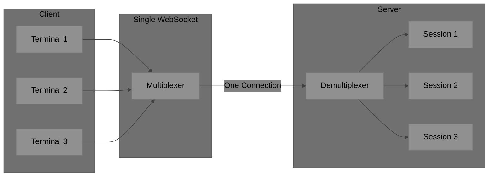
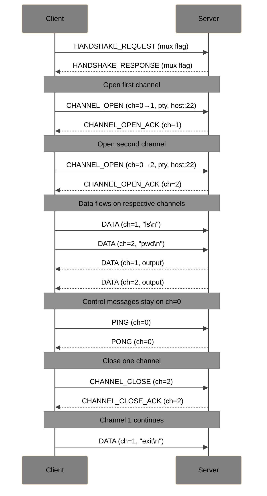
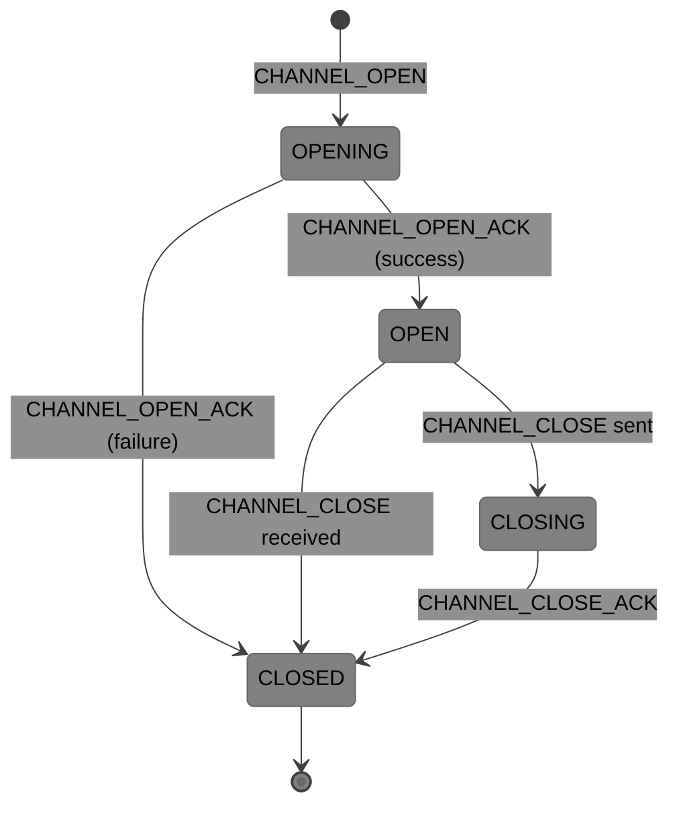

# SocketPipe Extension: Multiplexing

**Status**: Draft  
**Extension ID**: `multiplexing`  
**Depends on**: Core Protocol v1.0

## Overview

Multiplexing enables multiple logical sessions over a single WebSocket connection. This reduces connection overhead, simplifies firewall traversal, and enables coordinated multi-terminal workflows.

## Use Cases

- IDE with multiple terminal panes
- Split-screen terminal applications
- Reduced connection count for better performance
- Coordinated command execution across multiple shells

## Architecture



## Protocol Changes

### Capability Negotiation

**Flags** (byte 1 of header):
- Bit 3: `1` = Multiplexing supported

### Channel IDs

All messages include a channel ID when multiplexing is active:

**Extended Header** (when multiplexing enabled):

```
[Type: 1][Flags: 1][Channel ID: 2][Length: 4][Payload: variable]
```

The Reserved field becomes Channel ID:
- Channel 0: Control channel (connection-level messages)
- Channels 1-65534: Data channels
- Channel 65535: Reserved

### New Message Types

| Type | Name | Direction | Description |
| --- | --- | --- | --- |
| `0x70` | CHANNEL_OPEN | C→S | Request new channel |
| `0x71` | CHANNEL_OPEN_ACK | S→C | Channel opened successfully |
| `0x72` | CHANNEL_CLOSE | Both | Close specific channel |
| `0x73` | CHANNEL_CLOSE_ACK | Both | Acknowledge channel close |

### CHANNEL_OPEN (0x70)

Sent on Channel 0 to request a new channel.

**Payload**:

| Field | Size | Description |
| --- | --- | --- |
| Requested Channel ID | 2 bytes | Preferred channel ID (0 = server assigns) |
| Mode | 1 byte | 0 = tunnel, 1 = pty |
| Target Port | 2 bytes | Backend port |
| Host Length | 1 byte | Length of hostname |
| Target Host | variable | Hostname or IP |

### CHANNEL_OPEN_ACK (0x71)

**Flags**:
- Bit 0: `1` = Success, `0` = Failure

**Success Payload**:

| Field | Size | Description |
| --- | --- | --- |
| Assigned Channel ID | 2 bytes | Channel ID to use |

**Failure Payload**:

| Field | Size | Description |
| --- | --- | --- |
| Error Code | 2 bytes | Error code |
| Message Length | 1 byte | Length of message |
| Message | variable | Error description |

### CHANNEL_CLOSE (0x72)

**Payload**:

| Field | Size | Description |
| --- | --- | --- |
| Reason Code | 2 bytes | Close reason |

### CHANNEL_CLOSE_ACK (0x73)

**Payload**: Empty

## Connection Flow



## Channel Lifecycle



## Message Routing

| Message Type | Channel | Notes |
| --- | --- | --- |
| HANDSHAKE_* | N/A | Before multiplexing active |
| CHANNEL_OPEN | 0 | Always control channel |
| CHANNEL_OPEN_ACK | 0 | Always control channel |
| CHANNEL_CLOSE | Target | Channel being closed |
| PING/PONG | 0 | Connection-level keepalive |
| DATA | 1-65534 | Per-channel data |
| RESIZE | 1-65534 | Per-channel (PTY mode) |
| ERROR | 0 or target | 0 for connection, target for channel |

## Flow Control

Per-channel flow control (optional):

| Type | Name | Direction | Description |
| --- | --- | --- | --- |
| `0x74` | CHANNEL_WINDOW_UPDATE | Both | Increase receive window |

**Payload**:

| Field | Size | Description |
| --- | --- | --- |
| Window Increment | 4 bytes | Bytes to add to window |

Initial window: 64KB per channel (negotiable).

## Server Requirements

- MUST support at least 16 concurrent channels per connection
- SHOULD support at least 256 channels
- MUST handle channel-specific errors without affecting other channels
- MUST close all channels on connection close

## Client Requirements

- MUST track channel state independently
- MUST route messages to correct channel handlers
- SHOULD implement channel-level flow control for high-throughput scenarios

## Error Codes

| Code | Name | Description |
| --- | --- | --- |
| 5000 | CHANNEL_LIMIT | Maximum channels exceeded |
| 5001 | INVALID_CHANNEL | Unknown channel ID |
| 5002 | CHANNEL_REFUSED | Server refused channel (auth, policy) |
