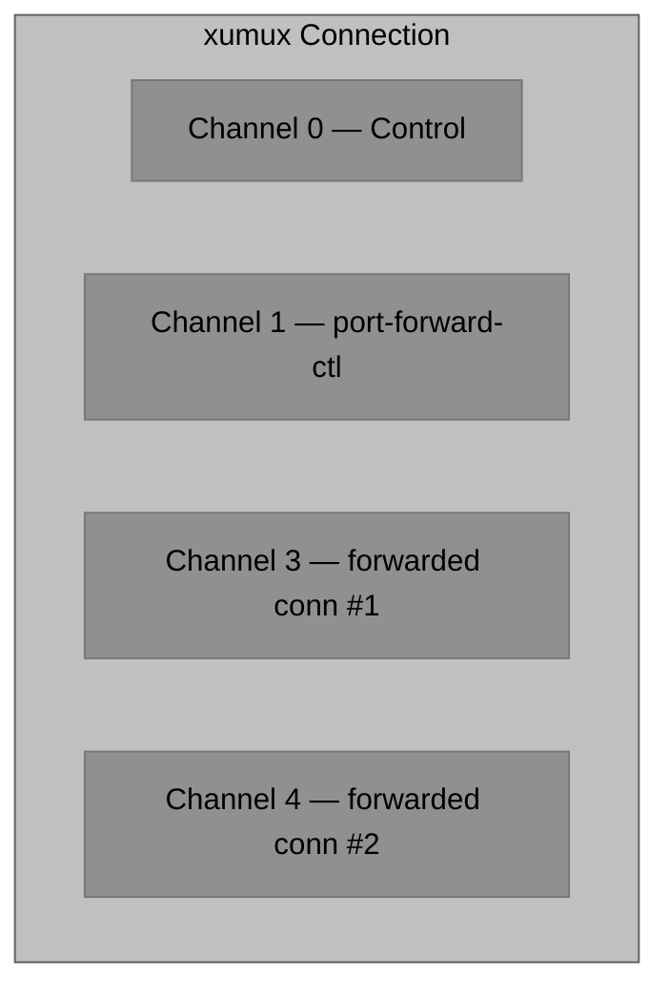
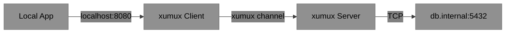
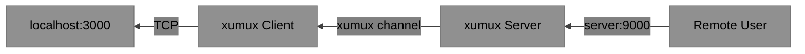
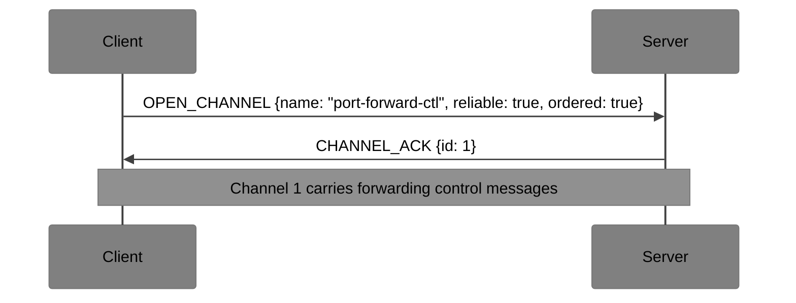
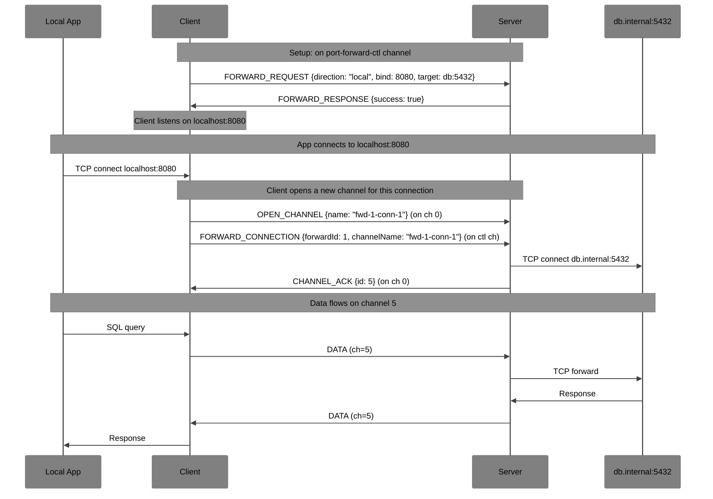
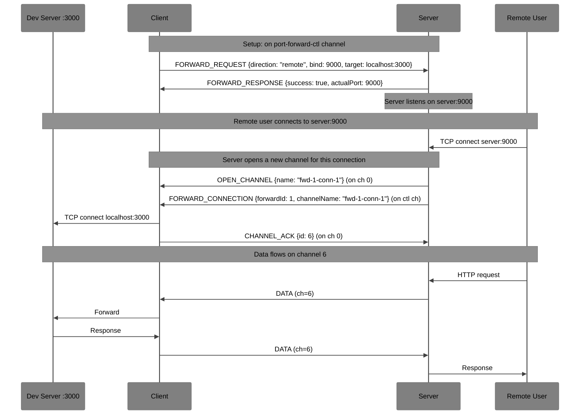

# xumux Extension: Port Forwarding

**Status**: Draft
**Extension ID**: `port-forwarding`
**Depends on**: xumux 0.1.0+

## Overview

Port Forwarding enables SSH-style local and remote TCP port forwarding over an xumux connection. Each forwarded connection gets its own xumux channel, leveraging native multiplexing.

## Use Cases

- Access remote database through an xumux connection
- Expose local development server to remote environment
- Secure tunneling of web services
- Jump host / bastion scenarios

## Architecture

Port forwarding control messages are sent on a dedicated `port-forward-ctl` channel. Each individual forwarded TCP connection is assigned its own dynamically opened channel.



## Forwarding Types

### Local Forwarding (-L)



### Remote Forwarding (-R)



## Channel Setup

The `port-forward-ctl` channel is opened during or after handshake:



## Control Messages (on port-forward-ctl channel)

| Type | Name | Direction | Description |
|------|------|-----------|-------------|
| `0x01` | FORWARD_REQUEST | Both | Request a port forward |
| `0x02` | FORWARD_RESPONSE | Both | Forward request result |
| `0x03` | FORWARD_CANCEL | Both | Cancel an active forward |
| `0x04` | FORWARD_CONNECTION | Both | New connection on a forward |
| `0x05` | FORWARD_CONNECTION_ACK | Both | Accept/reject forwarded connection |

### FORWARD_REQUEST (0x01)

**Payload** (JSON):
```json
{
  "forwardId": 1,
  "direction": "local",
  "bindAddress": "localhost",
  "bindPort": 8080,
  "targetAddress": "db.internal",
  "targetPort": 5432
}
```

| Field | Type | Required | Description |
|-------|------|----------|-------------|
| `forwardId` | number | MUST | Unique forward identifier |
| `direction` | string | MUST | `"local"` (-L) or `"remote"` (-R) |
| `bindAddress` | string | MUST | Address to bind (e.g., `"localhost"`, `"0.0.0.0"`) |
| `bindPort` | number | MUST | Port to bind (0 = dynamic) |
| `targetAddress` | string | MUST | Target host |
| `targetPort` | number | MUST | Target port |

### FORWARD_RESPONSE (0x02)

**Payload** (JSON):
```json
{
  "forwardId": 1,
  "success": true,
  "actualPort": 8080
}
```

On failure:
```json
{
  "forwardId": 1,
  "success": false,
  "code": 7000,
  "reason": "Port already in use"
}
```

### FORWARD_CONNECTION (0x04)

Sent when a new TCP connection arrives on a forwarded port. The sender also opens a new xumux channel for the connection data.

**Payload** (JSON):
```json
{
  "forwardId": 1,
  "channelName": "fwd-1-conn-1",
  "sourceAddress": "127.0.0.1",
  "sourcePort": 54321
}
```

The sender simultaneously sends an `OPEN_CHANNEL` on channel 0 with name matching `channelName`. The receiver correlates them.

## Local Forward Flow



## Remote Forward Flow



## Error Codes

| Code | Name | Description |
|------|------|-------------|
| 7000 | PORT_IN_USE | Requested port already bound |
| 7001 | PERMISSION_DENIED | Cannot bind to port (e.g., < 1024) |
| 7002 | FORWARD_LIMIT | Maximum forwards exceeded |
| 7003 | CONNECT_FAILED | Cannot connect to target |
| 7004 | FORWARD_DISABLED | Port forwarding not allowed by policy |
| 7005 | INVALID_ADDRESS | Invalid bind or target address |

## Security Considerations

- Remote forwards expose server ports; restrict by default
- Servers SHOULD only allow localhost binds unless explicitly configured
- Consider rate limiting new connections per forward
- Audit logging recommended for all forward requests
