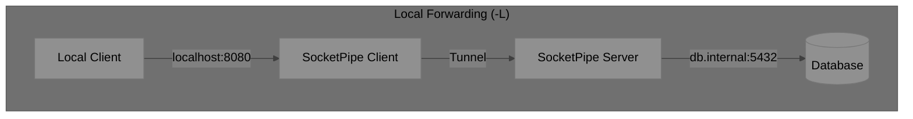
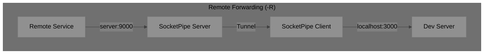
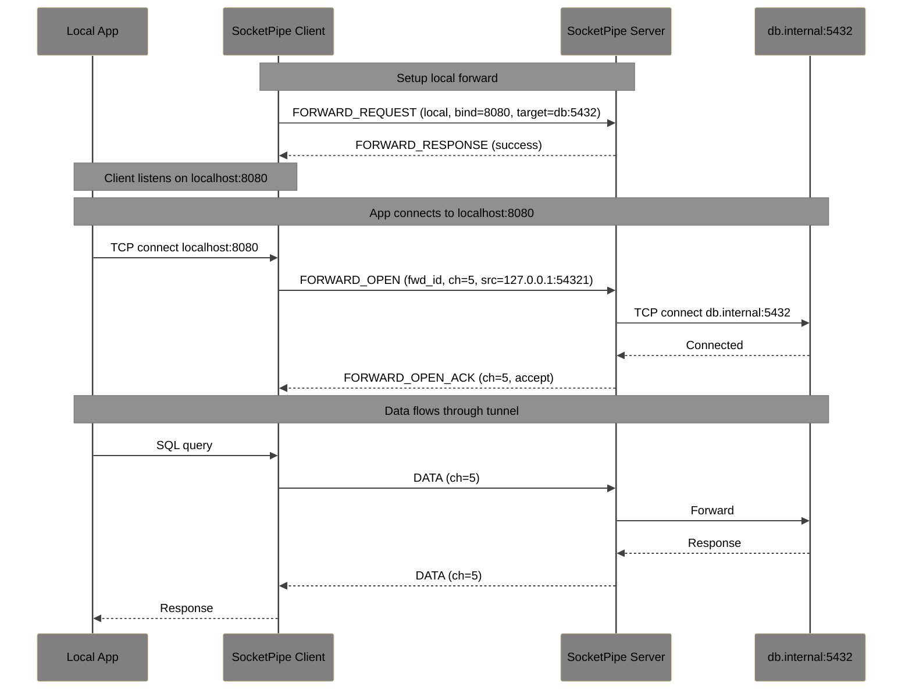
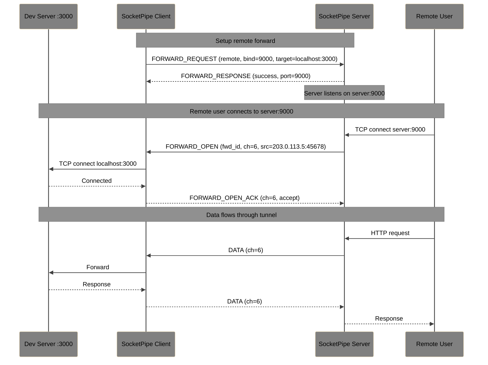
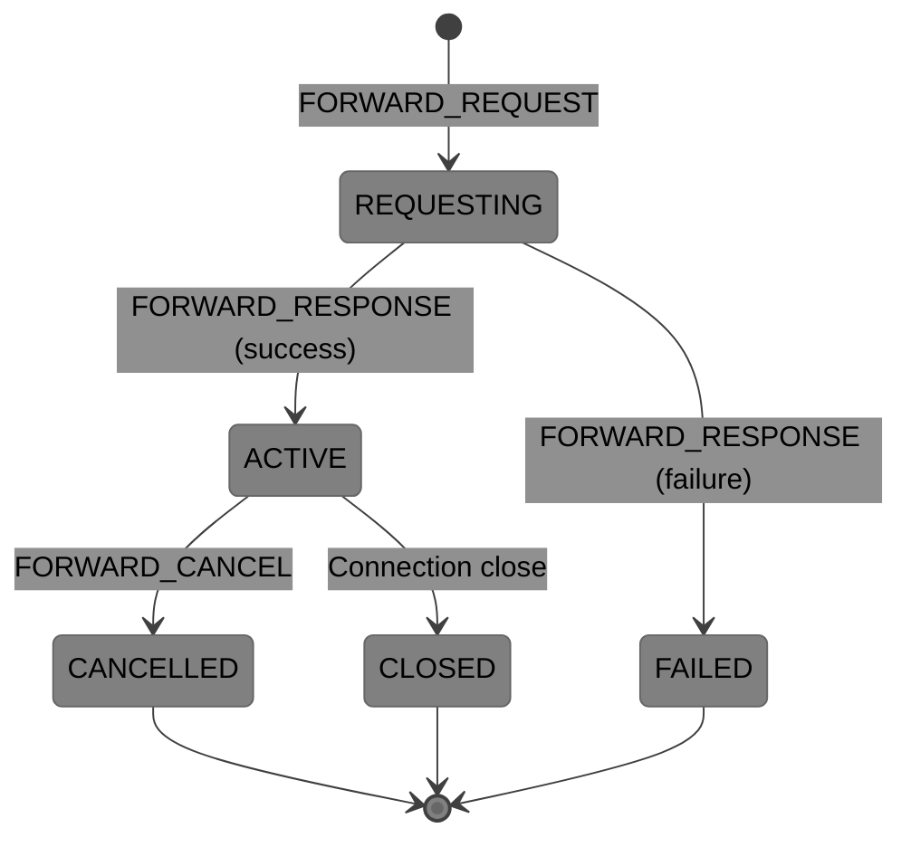

# SocketPipe Extension: Port Forwarding

**Status**: Draft  
**Extension ID**: `port-forwarding`  
**Depends on**: Core Protocol v1.0, Multiplexing Extension

## Overview

Port Forwarding enables SSH-style local and remote port forwarding over SocketPipe connections. This allows secure tunneling of arbitrary TCP services through the SocketPipe connection.

## Use Cases

- Access remote database through terminal connection
- Expose local development server to remote environment
- Secure tunneling of web services
- Jump host / bastion scenarios

## Forwarding Types

## Protocol Changes

### Capability Negotiation

**Flags** (byte 1 of header):
- Bit 5: `1` = Port Forwarding supported

### New Message Types

| Type | Name | Direction | Description |
| --- | --- | --- | --- |
| `0x90` | FORWARD_REQUEST | Both | Request port forward |
| `0x91` | FORWARD_RESPONSE | Both | Forward request result |
| `0x92` | FORWARD_CANCEL | Both | Cancel port forward |
| `0x93` | FORWARD_OPEN | Both | New forwarded connection |
| `0x94` | FORWARD_OPEN_ACK | Both | Accept forwarded connection |

### FORWARD_REQUEST (0x90)

**Payload**:

| Field | Size | Description |
| --- | --- | --- |
| Forward ID | 4 bytes | Client-assigned forward identifier |
| Direction | 1 byte | 0 = Local (-L), 1 = Remote (-R) |
| Bind Address Length | 1 byte | Length of bind address |
| Bind Address | variable | Address to bind (e.g., "localhost", "0.0.0.0") |
| Bind Port | 2 bytes | Port to bind |
| Target Address Length | 1 byte | Length of target address |
| Target Address | variable | Target host |
| Target Port | 2 bytes | Target port |

### FORWARD_RESPONSE (0x91)

**Flags**:
- Bit 0: `1` = Success, `0` = Failure

**Success Payload**:

| Field | Size | Description |
| --- | --- | --- |
| Forward ID | 4 bytes | Forward identifier |
| Actual Port | 2 bytes | Actual bound port (if 0 was requested) |

**Failure Payload**:

| Field | Size | Description |
| --- | --- | --- |
| Forward ID | 4 bytes | Forward identifier |
| Error Code | 2 bytes | Error code |
| Message Length | 1 byte | Length of message |
| Message | variable | Error description |

### FORWARD_CANCEL (0x92)

**Payload**:

| Field | Size | Description |
| --- | --- | --- |
| Forward ID | 4 bytes | Forward to cancel |

### FORWARD_OPEN (0x93)

Sent when a new connection arrives on a forwarded port.

**Payload**:

| Field | Size | Description |
| --- | --- | --- |
| Forward ID | 4 bytes | Associated forward |
| Channel ID | 2 bytes | Channel for this connection |
| Source Address Length | 1 byte | Length of source address |
| Source Address | variable | Connecting client's address |
| Source Port | 2 bytes | Connecting client's port |

### FORWARD_OPEN_ACK (0x94)

**Flags**:
- Bit 0: `1` = Accept, `0` = Reject

**Payload**:

| Field | Size | Description |
| --- | --- | --- |
| Channel ID | 2 bytes | Channel ID from FORWARD_OPEN |

## Local Forward Flow

## Remote Forward Flow

## Forward Lifecycle

## Error Codes

| Code | Name | Description |
| --- | --- | --- |
| 7000 | PORT_IN_USE | Requested port already bound |
| 7001 | PERMISSION_DENIED | Cannot bind to port (e.g., < 1024) |
| 7002 | FORWARD_LIMIT | Maximum forwards exceeded |
| 7003 | CONNECT_FAILED | Cannot connect to target |
| 7004 | FORWARD_DISABLED | Port forwarding not allowed by policy |
| 7005 | INVALID_ADDRESS | Invalid bind or target address |

## Server Requirements

- MUST support at least 10 concurrent forwards
- MUST enforce bind address restrictions (e.g., localhost only)
- SHOULD support dynamic port allocation (bind port 0)
- MAY restrict forwarding based on authentication

## Security Considerations

- Remote forwards expose server ports; restrict by default
- Servers SHOULD only allow localhost binds unless explicitly configured
- Consider rate limiting new connections per forward
- Audit logging recommended for all forward requests
- GatewayPorts equivalent: binding to 0.0.0.0 vs localhost
