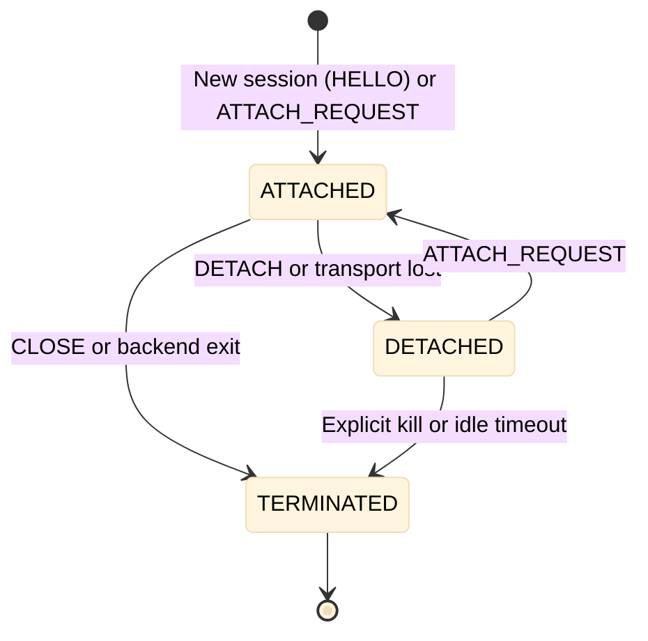
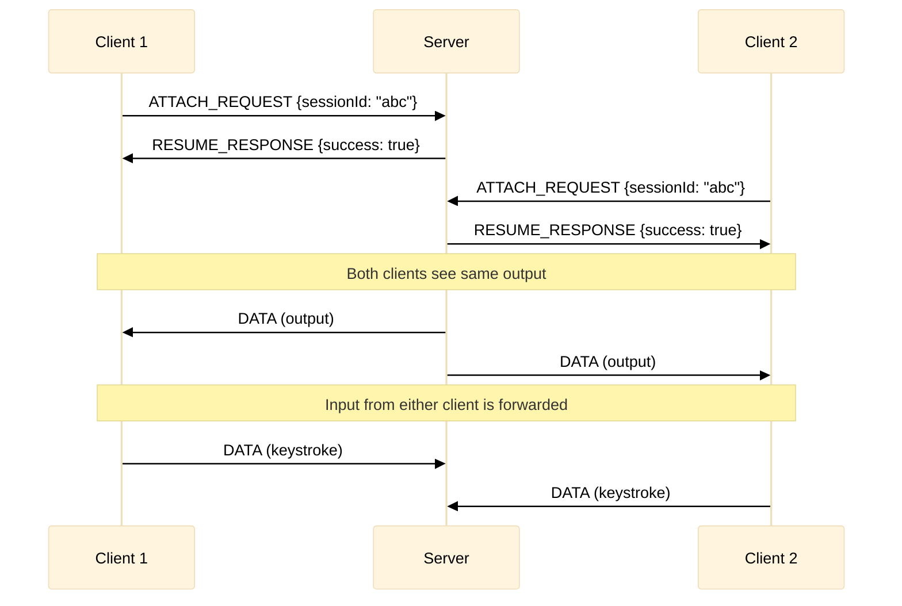
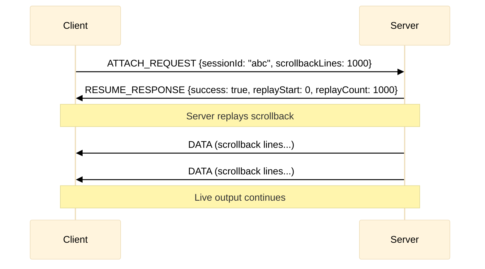

# xumux Extension: Session Persistence

**Status**: Draft
**Extension ID**: `session-persistence`
**Depends on**: xumux 0.1.0+, Session Resume Extension (`session-resume`)

## Overview

Session Persistence extends Session Resume to support indefinite session survival, similar to `tmux` or `screen`. Sessions continue running on the server even when no client is connected, and clients can reconnect at any time.

This is negotiated as an xumux extension in the HELLO/WELCOME handshake. Requesting `session-persistence` implies `session-resume`.

## Use Cases

- Long-running processes that outlive browser sessions
- Shared terminal access (multiple clients attaching to same session)
- "Detach and reattach" workflow familiar from tmux/screen
- Handoff between devices

## Differences from Session Resume

| Aspect | Session Resume | Session Persistence |
|--------|---------------|---------------------|
| Duration | Minutes (network glitch) | Hours/days/indefinite |
| Buffer | Limited (64KB+) | Scrollback buffer (configurable) |
| Storage | Memory only | May persist to disk |
| Multi-client | No | Yes (optional) |
| Explicit detach | No | Yes |

## Extension Negotiation

```json
{
  "version": [0, 1, 0],
  "extensions": ["session-resume", "session-persistence"],
  "channels": [...]
}
```

## Additional Control Messages (on channel 0)

| Type | Name | Direction | Description |
|------|------|-----------|-------------|
| `0x33` | DETACH | C→S | Client explicitly detaches |
| `0x34` | SESSION_LIST_REQUEST | C→S | List available sessions |
| `0x35` | SESSION_LIST_RESPONSE | S→C | Available sessions |
| `0x36` | ATTACH_REQUEST | C→S | Attach to existing session |

### DETACH (0x33)

Client explicitly detaches without terminating the session.

**Payload** (JSON):
```json
{
  "reason": "switching devices"
}
```

Server responds with CLOSE `{code: 1000, reason: "detached"}` but keeps the session alive.

### SESSION_LIST_REQUEST (0x34)

Sent after transport connect (before or instead of HELLO) to list sessions available for this client.

**Payload**: empty (0 bytes) or `{}`

### SESSION_LIST_RESPONSE (0x35)

**Payload** (JSON):
```json
{
  "sessions": [
    {
      "sessionId": "abc123",
      "name": "dev-server",
      "created": 1707500000,
      "lastActivity": 1707503600,
      "attachedClients": 0,
      "channels": ["terminal", "file-transfer"]
    }
  ]
}
```

### ATTACH_REQUEST (0x36)

Attach to an existing persistent session (alternative to RESUME_REQUEST for long-lived sessions).

**Payload** (JSON):
```json
{
  "sessionId": "abc123",
  "scrollbackLines": 1000
}
```

Server responds with RESUME_RESPONSE (0x32 from session-resume extension) including channel restoration info.

## Extended SESSION_ID

When persistence is active, the SESSION_ID message (0x30) includes additional fields:

```json
{
  "sessionId": "abc123",
  "resumeTimeout": 0,
  "bufferSize": 1048576,
  "persistent": true,
  "multiClient": true,
  "scrollbackLines": 10000
}
```

| Field | Type | Description |
|-------|------|-------------|
| `persistent` | boolean | Session survives indefinite disconnection |
| `multiClient` | boolean | Multiple clients may attach simultaneously |
| `scrollbackLines` | number | Lines of scrollback available on attach |

## Session Lifecycle



## Multi-Client Behavior

When multiple clients attach to the same session:



## Scrollback Replay



## Server Requirements

- MUST maintain session state independent of client connections
- MUST support configurable scrollback buffer (default: 10,000 lines)
- SHOULD support disk-backed sessions for crash recovery
- MAY support session naming for easier identification
- MUST enforce per-user session limits

## Security Considerations

- Sessions MUST be bound to authentication tokens
- Multi-client access SHOULD require same token or explicit sharing
- Servers SHOULD implement idle timeout for detached sessions
- Scrollback MAY contain sensitive data; consider encryption at rest
