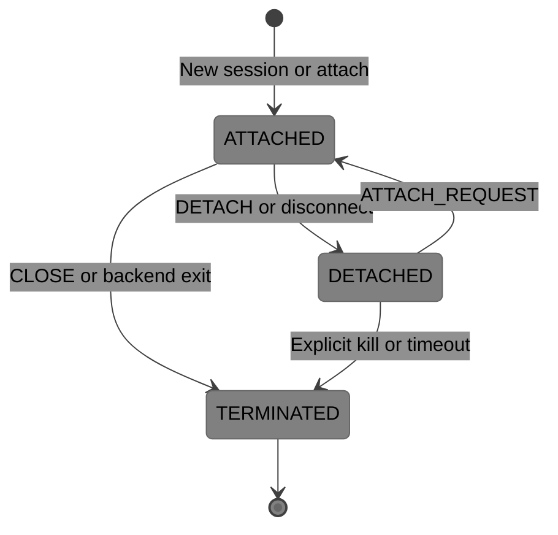
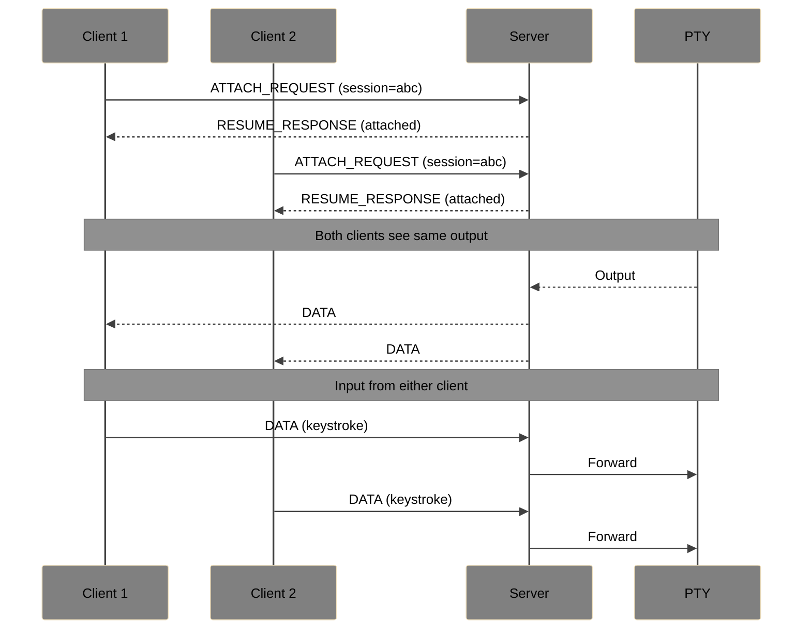
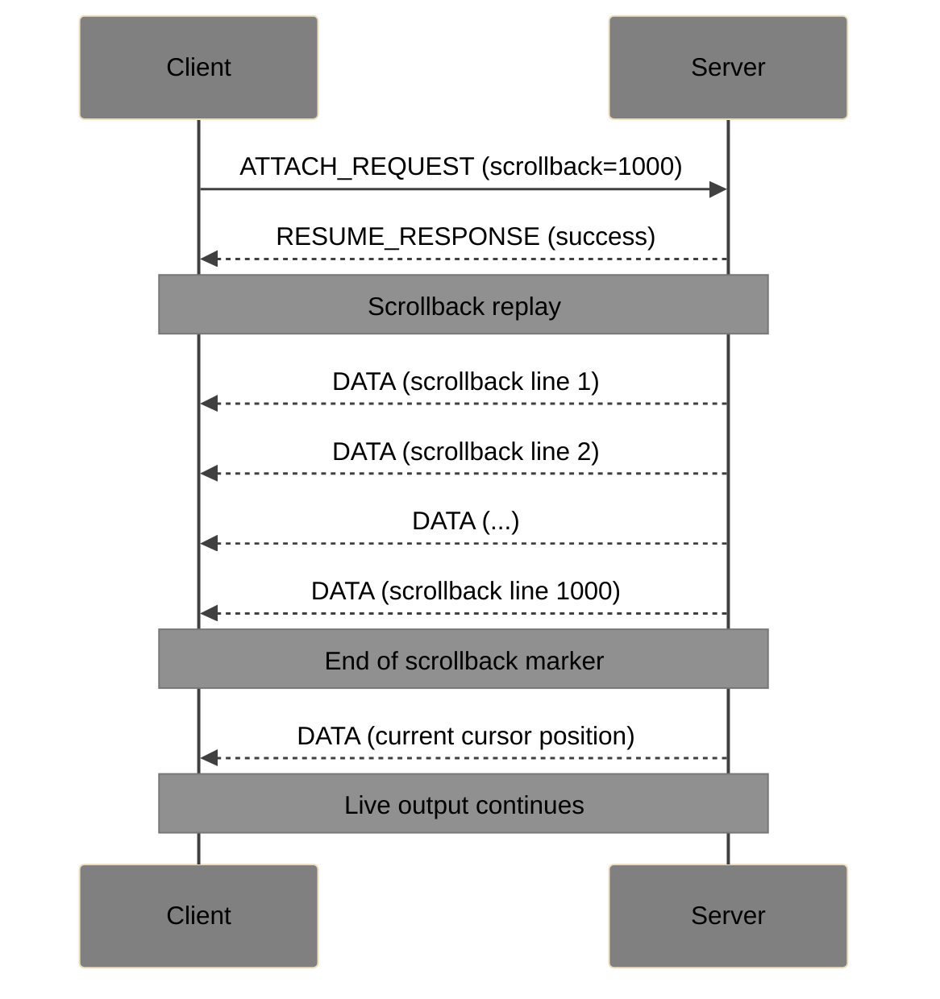

# SocketPipe Extension: Session Persistence

**Status**: Draft  
**Extension ID**: `session-persistence`  
**Depends on**: Core Protocol v1.0, Session Resume Extension

## Overview

Session Persistence extends Session Resume to support indefinite session survival, similar to `tmux` or `screen`. Sessions continue running on the server even when no client is connected, and clients can reconnect at any time.

## Use Cases

- Long-running processes that outlive browser sessions
- Shared terminal access (multiple clients attaching to same session)
- "Detach and reattach" workflow familiar from tmux/screen
- Handoff between devices

## Differences from Session Resume

| Aspect | Session Resume | Session Persistence |
| --- | --- | --- |
| Duration | Minutes (network glitch) | Hours/days/indefinite |
| Buffer | Limited (64KB+) | Scrollback buffer (configurable) |
| Storage | Memory only | May persist to disk |
| Multi-client | No | Yes (optional) |
| Explicit detach | No | Yes |

## Protocol Changes

### Capability Negotiation

**Flags** (byte 1 of header):
- Bit 2: `1` = Session Persistence supported (implies Session Resume)

### New Message Types

| Type | Name | Direction | Description |
| --- | --- | --- | --- |
| `0x53` | DETACH | C→S | Client explicitly detaches |
| `0x54` | SESSION_LIST_REQUEST | C→S | List available sessions |
| `0x55` | SESSION_LIST_RESPONSE | S→C | Available sessions for this token |
| `0x56` | ATTACH_REQUEST | C→S | Attach to existing session |

### Extended SESSION_ID (0x50)

Additional fields when persistence is active:

| Field | Size | Description |
| --- | --- | --- |
| ... | ... | (base fields from Session Resume) |
| Persistence Flags | 1 byte | Persistence options |
| Scrollback Size | 4 bytes | Lines of scrollback available |

**Persistence Flags**:
- Bit 0: Multi-client allowed
- Bit 1: Session persists on server disconnect
- Bit 2: Session has disk backing

### DETACH (0x53)

Client explicitly detaches without terminating the session.

**Payload**: Empty

Server responds with CLOSE (reason: detached) but keeps session alive.

### SESSION_LIST_REQUEST (0x54)

Sent after WebSocket connect to list sessions available for the authenticated token.

**Payload**: Empty

### SESSION_LIST_RESPONSE (0x55)

**Payload**:

| Field | Size | Description |
| --- | --- | --- |
| Session Count | 2 bytes | Number of sessions |
| Sessions | variable | Array of session entries |

**Session Entry**:

| Field | Size | Description |
| --- | --- | --- |
| Session ID Length | 1 byte | Length of session ID |
| Session ID | variable | Session identifier |
| Created | 8 bytes | Unix timestamp |
| Last Activity | 8 bytes | Unix timestamp |
| Attached Clients | 2 bytes | Current client count |
| Name Length | 1 byte | Length of session name |
| Name | variable | Human-readable name (optional) |

### ATTACH_REQUEST (0x56)

Attach to an existing persistent session (alternative to RESUME_REQUEST).

**Payload**:

| Field | Size | Description |
| --- | --- | --- |
| Session ID Length | 1 byte | Length of session ID |
| Session ID | variable | Target session ID |
| Scrollback Lines | 4 bytes | Lines of scrollback to receive (0 = none) |

## Session Lifecycle

## Multi-Client Behavior

When multiple clients attach to the same session:

## Scrollback Replay

On attach, client can request scrollback:

## Server Requirements

- MUST maintain session state independent of client connections
- MUST support configurable scrollback buffer (default: 10,000 lines)
- SHOULD support disk-backed sessions for crash recovery
- MAY support session naming for easier identification
- MUST enforce per-user session limits

## Security Considerations

- Sessions MUST be bound to authentication tokens
- Multi-client access SHOULD require same token or explicit sharing
- Servers SHOULD implement idle timeout for detached sessions
- Scrollback MAY contain sensitive data; consider encryption at rest
