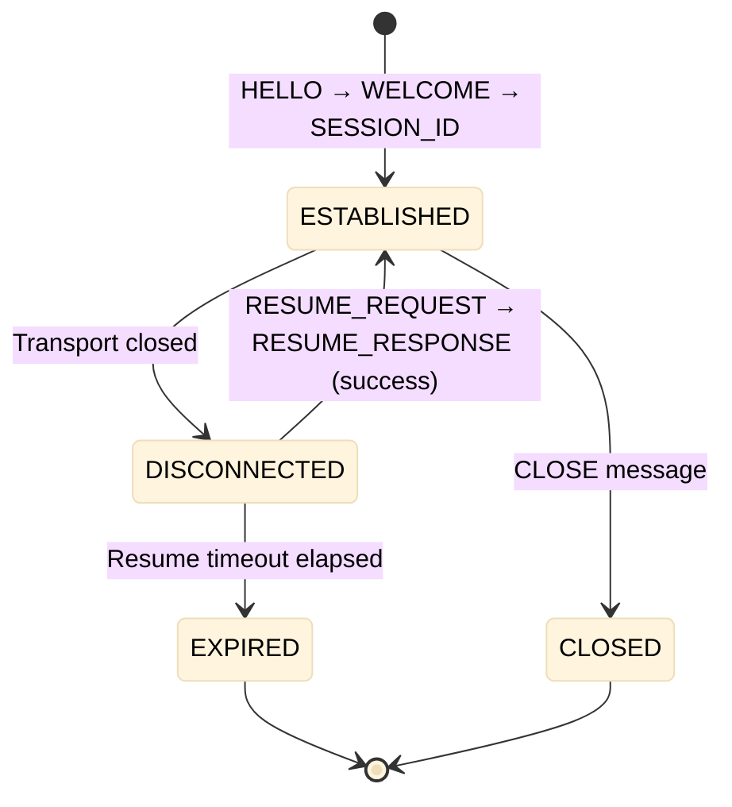
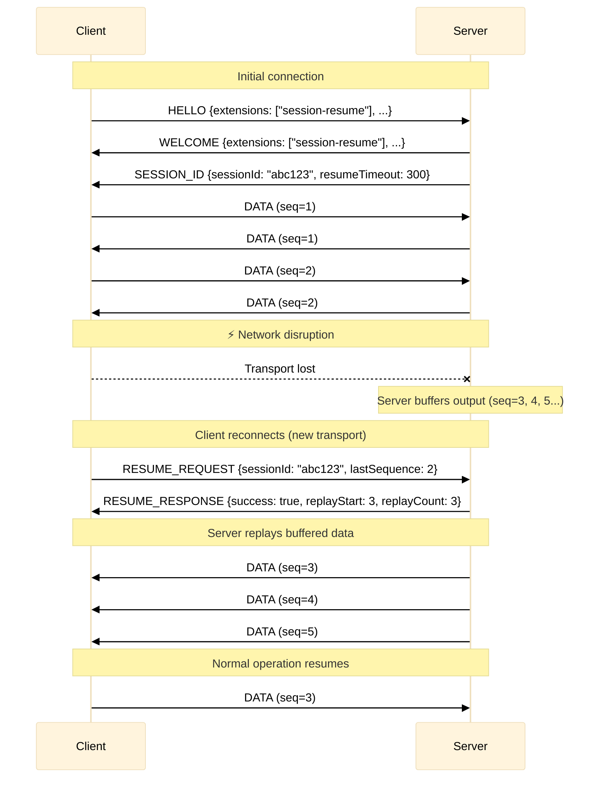

# xumux Extension: Session Resume

**Status**: Draft
**Extension ID**: `session-resume`
**Depends on**: xumux 0.1.0+

## Overview

Session Resume enables clients to reconnect to an existing xumux session after network disruption without losing state. The server buffers output during disconnection and replays it upon reconnection.

This is negotiated as an xumux extension in the HELLO/WELCOME handshake.

## Use Cases

- Mobile users moving between networks (WiFi → cellular)
- Temporary network outages
- Laptop sleep/wake cycles
- Browser tab backgrounding

## Extension Negotiation

Clients advertise support in HELLO:

```json
{
  "version": [0, 1, 0],
  "extensions": ["session-resume"],
  "channels": [...]
}
```

If the server supports it, `"session-resume"` appears in the WELCOME `extensions` array.

## Additional Control Messages (on channel 0)

When `session-resume` is negotiated, the following additional control channel message types are available:

| Type | Name | Direction | Description |
|------|------|-----------|-------------|
| `0x30` | SESSION_ID | S→C | Server assigns session ID after WELCOME |
| `0x31` | RESUME_REQUEST | C→S | Client requests session resumption (replaces HELLO on reconnect) |
| `0x32` | RESUME_RESPONSE | S→C | Server accepts/rejects resumption |

### SESSION_ID (0x30)

Sent by server on channel 0 immediately after WELCOME when `session-resume` is negotiated.

**Payload** (JSON):
```json
{
  "sessionId": "a1b2c3d4e5f6...",
  "resumeTimeout": 300,
  "bufferSize": 65536
}
```

| Field | Type | Description |
|-------|------|-------------|
| `sessionId` | string | Opaque session identifier (min 128-bit entropy) |
| `resumeTimeout` | number | Seconds server will hold session after disconnect (0 = indefinite) |
| `bufferSize` | number | Max bytes server will buffer during disconnect |

### RESUME_REQUEST (0x31)

Sent by client as the **first message** after transport reconnect (instead of HELLO).

**Payload** (JSON):
```json
{
  "sessionId": "a1b2c3d4e5f6...",
  "lastSequence": 42
}
```

| Field | Type | Description |
|-------|------|-------------|
| `sessionId` | string | Session ID from previous SESSION_ID |
| `lastSequence` | number | Last DATA sequence number received by client |

### RESUME_RESPONSE (0x32)

**Payload** (JSON):

Success:
```json
{
  "success": true,
  "replayStart": 43,
  "replayCount": 5
}
```

Failure:
```json
{
  "success": false,
  "code": 4101,
  "reason": "Session expired"
}
```

## Sequence Numbers

When `session-resume` is active, DATA messages on all channels include a connection-wide sequence number. This is carried in the Reserved byte of the frame header (repurposed when this extension is active) or as a prefix to the payload:

**Extended DATA payload** (when session-resume active):
```
[Sequence:8][Data:variable]
```

Sequence numbers are monotonically increasing, scoped to the connection (not per-channel).

## Session Lifecycle



## Resume Flow



## Error Codes (application-defined range 4100+)

| Code | Name | Description |
|------|------|-------------|
| 4100 | SESSION_NOT_FOUND | Session ID not recognized |
| 4101 | SESSION_EXPIRED | Resume timeout exceeded |
| 4102 | BUFFER_OVERFLOW | Buffered data exceeded limit, data lost |
| 4103 | SEQUENCE_MISMATCH | Client sequence doesn't match server state |

## Server Requirements

- MUST buffer at least 64KB of output per session
- MUST hold sessions for at least 60 seconds after disconnect
- SHOULD provide configurable buffer size and timeout
- MUST reject resume if buffer overflowed (client must start fresh)
- All open channels are preserved across resume

## Client Requirements

- MUST store session ID in memory (not persisted to disk)
- MUST track last received sequence number
- SHOULD attempt RESUME_REQUEST before falling back to fresh HELLO
- MUST handle RESUME_RESPONSE failure gracefully (fall back to new HELLO)

## Security Considerations

- Session IDs MUST be cryptographically random (min 128 bits entropy)
- Session IDs MUST NOT be logged in plaintext
- Servers SHOULD bind sessions to client token to prevent hijacking
- Resume timeout SHOULD be limited to prevent resource exhaustion
