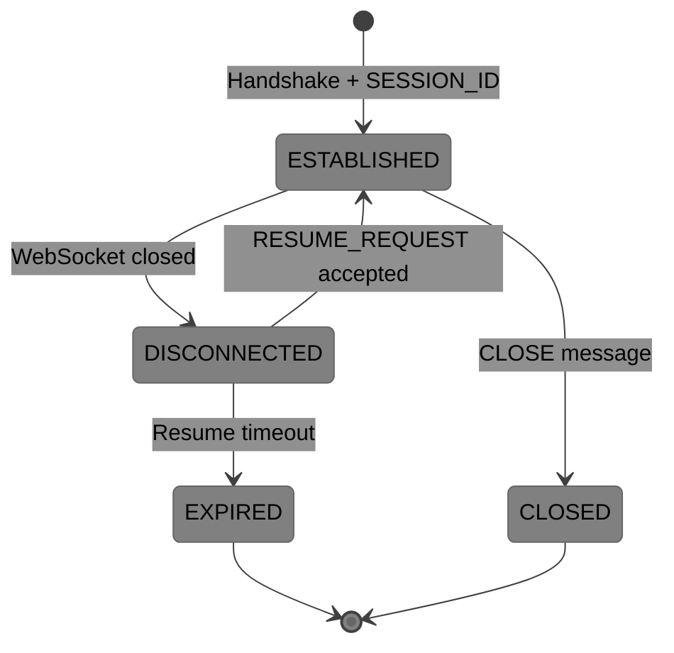
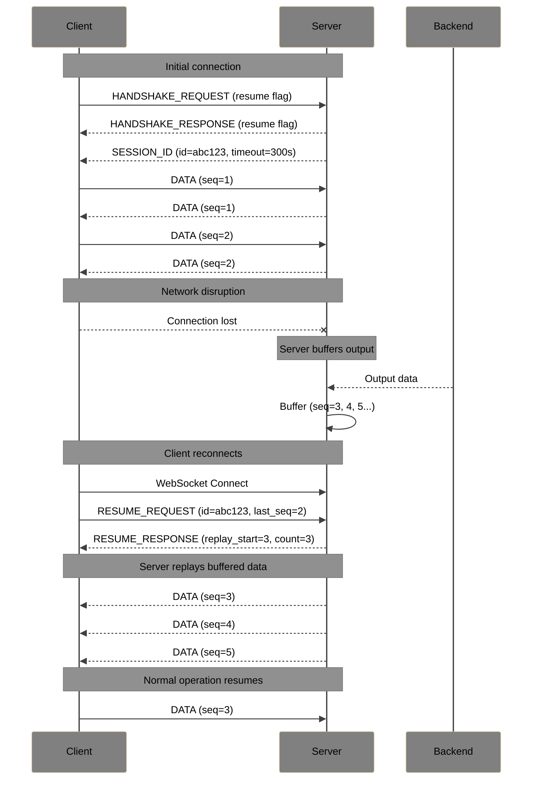

# SocketPipe Extension: Session Resume

**Status**: Draft  
**Extension ID**: `session-resume`  
**Depends on**: Core Protocol v1.0

## Overview

Session Resume enables clients to reconnect to an existing session after network disruption without losing state. The server buffers output during disconnection and replays it upon reconnection.

## Use Cases

- Mobile users moving between networks (WiFi → cellular)
- Temporary network outages
- Laptop sleep/wake cycles
- Browser tab backgrounding

## Protocol Changes

### Capability Negotiation

Clients advertise support in HANDSHAKE_REQUEST via a new flag:

**Flags** (byte 1 of header):
- Bit 1: `1` = Session Resume supported

Servers respond with the same flag if they support it.

### New Message Types

| Type | Name | Direction | Description |
| --- | --- | --- | --- |
| `0x50` | SESSION_ID | S→C | Server assigns session ID after handshake |
| `0x51` | RESUME_REQUEST | C→S | Client requests session resumption |
| `0x52` | RESUME_RESPONSE | S→C | Server accepts/rejects resumption |

### SESSION_ID (0x50)

Sent by server immediately after successful HANDSHAKE_RESPONSE when resume is negotiated.

**Payload**:

| Field | Size | Description |
| --- | --- | --- |
| Session ID Length | 1 byte | Length of session ID |
| Session ID | variable | Opaque session identifier (max 255 bytes) |
| Resume Timeout | 4 bytes | Seconds server will hold session (0 = indefinite) |
| Buffer Size | 4 bytes | Max bytes server will buffer during disconnect |

### RESUME_REQUEST (0x51)

Sent by client as first message after WebSocket reconnect (instead of HANDSHAKE_REQUEST).

**Payload**:

| Field | Size | Description |
| --- | --- | --- |
| Session ID Length | 1 byte | Length of session ID |
| Session ID | variable | Session ID from previous SESSION_ID message |
| Last Sequence | 8 bytes | Last DATA sequence number received |

### RESUME_RESPONSE (0x52)

**Flags**:
- Bit 0: `1` = Success, `0` = Failure

**Success Payload**:

| Field | Size | Description |
| --- | --- | --- |
| Replay Start | 8 bytes | Sequence number of first replayed message |
| Replay Count | 4 bytes | Number of messages to be replayed |

**Failure Payload**:

| Field | Size | Description |
| --- | --- | --- |
| Error Code | 2 bytes | Resume-specific error code |
| Message Length | 1 byte | Length of error message |
| Message | variable | Human-readable error |

### Sequence Numbers

When session resume is active, DATA messages include sequence numbers:

**DATA Flags** (when resume active):
- Bit 1: `1` = Sequence number present

**Extended DATA Payload**:

| Field | Size | Description |
| --- | --- | --- |
| Sequence Number | 8 bytes | Monotonically increasing (present if flag set) |
| Data | variable | Original payload |

## Session Lifecycle

## Resume Flow

## Error Codes

| Code | Name | Description |
| --- | --- | --- |
| 4000 | SESSION_NOT_FOUND | Session ID not recognized |
| 4001 | SESSION_EXPIRED | Resume timeout exceeded |
| 4002 | BUFFER_OVERFLOW | Buffered data exceeded limit, data lost |
| 4003 | SEQUENCE_MISMATCH | Client sequence doesn't match server state |

## Server Requirements

- MUST buffer at least 64KB of output per session
- MUST hold sessions for at least 60 seconds after disconnect
- SHOULD provide configurable buffer size and timeout
- MUST reject resume if buffer overflowed (client must start fresh)

## Client Requirements

- MUST store session ID securely (memory only, not persisted)
- MUST track last received sequence number
- SHOULD attempt resume before falling back to fresh connection
- MUST handle RESUME_RESPONSE failure gracefully

## Security Considerations

- Session IDs MUST be cryptographically random (min 128 bits entropy)
- Session IDs MUST NOT be logged in plaintext
- Servers SHOULD bind sessions to client IP or token to prevent hijacking
- Resume timeout SHOULD be limited to prevent resource exhaustion
