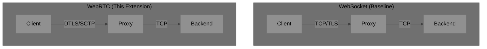
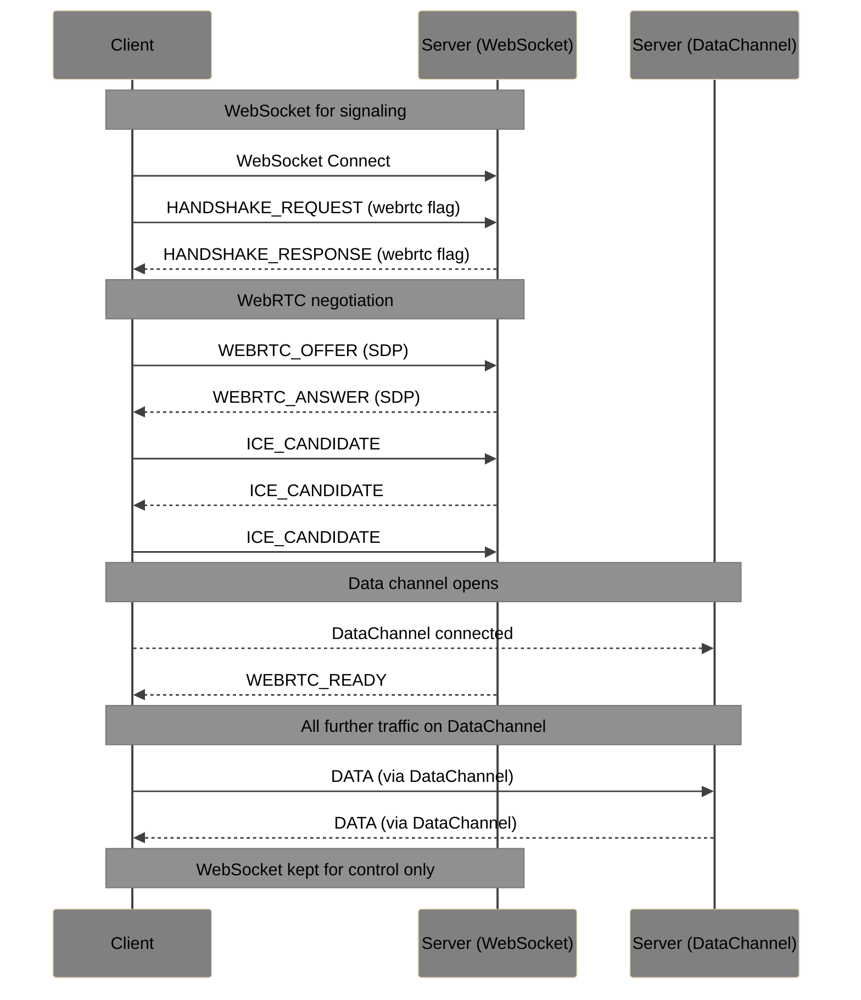
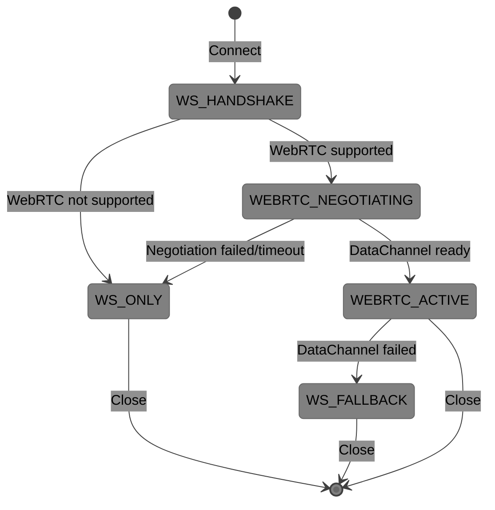

# SocketPipe Extension: WebRTC Transport

**Status**: Draft  
**Extension ID**: `webrtc-transport`  
**Depends on**: Core Protocol v1.0

## Overview

WebRTC Transport provides an alternative to WebSocket using WebRTC Data Channels. This enables lower latency through UDP transport, better NAT traversal, and potential peer-to-peer connections.

## Use Cases

- Latency-sensitive terminal applications
- Environments where WebSocket proxies add latency
- Direct browser-to-server connections bypassing HTTP infrastructure
- Potential P2P terminal sharing

## Architecture



## Protocol Changes

### Signaling

WebRTC requires a signaling channel to exchange SDP offers/answers and ICE candidates. SocketPipe uses WebSocket as the signaling channel.

### Signaling Messages

| Type | Name | Direction | Description |
| --- | --- | --- | --- |
| `0x60` | WEBRTC_OFFER | C→S | SDP offer from client |
| `0x61` | WEBRTC_ANSWER | S→C | SDP answer from server |
| `0x62` | ICE_CANDIDATE | Both | ICE candidate exchange |
| `0x63` | WEBRTC_READY | S→C | Data channel established |

### Connection Flow



### WEBRTC_OFFER (0x60)

**Payload**:

| Field | Size | Description |
| --- | --- | --- |
| SDP Length | 2 bytes | Length of SDP |
| SDP | variable | SDP offer string (UTF-8) |

### WEBRTC_ANSWER (0x61)

**Payload**:

| Field | Size | Description |
| --- | --- | --- |
| SDP Length | 2 bytes | Length of SDP |
| SDP | variable | SDP answer string (UTF-8) |

### ICE_CANDIDATE (0x62)

**Payload**:

| Field | Size | Description |
| --- | --- | --- |
| Candidate Length | 2 bytes | Length of candidate |
| Candidate | variable | ICE candidate string (UTF-8) |
| SDP Mid Length | 1 byte | Length of SDP mid |
| SDP Mid | variable | SDP media ID |
| SDP MLine Index | 2 bytes | SDP media line index |

### WEBRTC_READY (0x63)

**Payload**: Empty

Signals that the data channel is ready. Client SHOULD switch to DataChannel for DATA messages.

## Data Channel Configuration

| Parameter | Value | Rationale |
| --- | --- | --- |
| Label | `socketpipe` | Identification |
| Ordered | `true` | Terminal data must be ordered |
| Protocol | `socketpipe/1.0` | Protocol identification |
| Max Retransmits | (none) | Reliable delivery required |

## Message Format on DataChannel

Messages on the DataChannel use the same binary frame format as WebSocket:

```
[Type: 1][Flags: 1][Reserved: 2][Length: 4][Payload: variable]
```

## Fallback Behavior



- If WebRTC negotiation fails within 10 seconds, fall back to WebSocket
- If DataChannel disconnects, fall back to WebSocket (session resume if available)
- WebSocket connection MUST remain open for control messages

## Server Requirements

- MUST support WebSocket as baseline
- MAY support WebRTC as optional transport
- MUST maintain WebSocket for signaling even when DataChannel active
- MUST handle fallback gracefully
- SHOULD support TURN relay for NAT traversal

## Client Requirements

- MUST support WebSocket as baseline
- MAY attempt WebRTC upgrade
- MUST handle fallback to WebSocket
- SHOULD implement ICE restart on connectivity issues

## Security Considerations

- DataChannel is encrypted via DTLS (mandatory in WebRTC)
- TURN credentials MUST be short-lived and scoped
- Servers SHOULD validate that DataChannel peer matches WebSocket peer
- P2P mode (future) requires additional authentication
