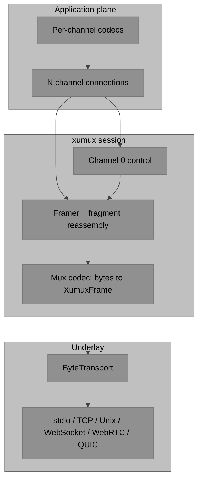
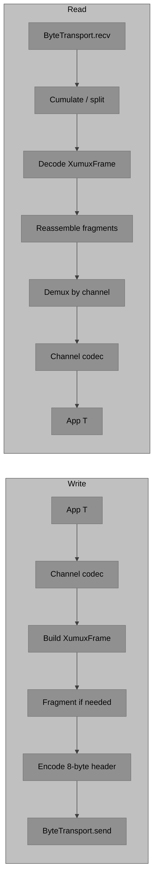

# xumux I/O stack

**Status**: Draft
**Audience**: Library implementers (`libxumux` and ports)

This note maps a Netty-style I/O pipeline (as used by Deft's internal Subspace foundation) onto xumux. Steal the **pipeline shape**, not product codecs or a single typed RPC connection.

The TypeScript reference is [libxumux](https://github.com/deftai/libxumux). Application protocols (VROOM, etc.) live in [deftai/vroom](https://github.com/deftai/vroom).

## The bet

**One ByteTransport → one xumux session → N channel connections.**

- Framing stays at the mux.
- Message codecs live per application channel (VROOM Terminal control CBOR, raw PTY bytes, …).
- xumux itself does not define those codecs. It multiplexes named channels and delivers payloads.



## Concept map

| Subspace | In xumux / libxumux |
|----------|---------------------|
| **ByteTransport** | Underlay that carries bytes: stdio, TCP, Unix, WebSocket, WebRTC DataChannel, QUIC. Dial / accept / **attach**. Attach is primary for WebRTC — signaling finishes outside the mux; wrap the already-open DataChannel. |
| **Framer** | xumux's 8-byte frame `[chan:2][type:1][flags:1][len:4][payload]` plus stateful fragment reassembly. Stream transports need cumulation. Message transports often carry one frame per message and still obey `FRAGMENT` / `FRAGMENT_END`. Fresh framer per connection — never share decoder state across peers. |
| **Codec (mux level)** | Nearly identity: bytes ↔ `XumuxFrame`. Do **not** put CBOR or JSON here. |
| **Codec (channel / app level)** | Above open channels — VROOM Terminal control CBOR, raw PTY, graphical events, etc. Out of scope for xumux; this is the seam application protocols own. |
| **Connection\<T\>** | Not one typed connection for the whole session. One **session**, then one logical connection per open channel. |
| **MessageTransport** | In-process / tests. libxumux already has an in-memory adapter. Use `encodeRoundTrip` (encode then decode) for wire parity. |
| **Middleware** | Auth, logging, and rate-limit belong on the control plane or app codecs. Keep the mux hot path thin (frame, fragment, demux). |
| **Presets (`define*`)** | VROOM (and similar) protocols are presets that `OPEN` named channels with reliability flags — not new underlays. |

## Attach first

xumux already assumes the transport is established before the protocol starts (see README non-goals: no transport negotiation). That is Subspace **attach-first**:

| Mode | When | Example |
|------|------|---------|
| **attach** | Underlay already exists | Wrap a connected `net.Socket`, an open WebRTC DataChannel, or a parent/child stdio pair. **Primary for WebRTC** — SDP/ICE/DTLS finish outside; the mux never signals. |
| **dial** | Client creates the underlay, then attaches | `connect()` a TCP socket or WebSocket, then hand the stream to the session. |
| **accept** | Server accepts, then attaches | `listen()` / `accept()`, then wrap each accepted stream in its own session + framer. |

Dial and accept are convenience around attach. The session constructor should take a byte pipe, not a URL, whenever the underlay is not owned by the mux (WebRTC, inherited stdio, a socket passed from a supervisor).

## Write and read paths



**Write**

1. Application code produces a typed message (or raw bytes) for one named channel.
2. The **channel codec** (VROOM, ACP binding, …) serializes to payload bytes. The mux does not do this.
3. The session builds an `XumuxFrame` (`channel`, `type`, `flags`, `payload`).
4. The framer splits on MTU / `maxMessageSize` (`FRAGMENT` / `FRAGMENT_END`). Skip fragmentation on `unordered` / `unreliable` channels.
5. Encode the 8-byte header. On stream underlays, send `OMUX` magic once before the first frame.
6. `ByteTransport.send`.

**Read**

1. `ByteTransport.recv` yields bytes or datagrams.
2. **Stream** underlays (TCP, Unix, stdio): accumulate into a buffer; emit a frame when `8 + length` bytes are present. **Message** underlays (WebSocket, WebRTC DataChannel): treat each message as one frame, still honor fragment flags.
3. Mux codec: bytes → `XumuxFrame` (identity parse of the header).
4. Per-channel reassembler until `FRAGMENT_END` (or a non-fragment frame).
5. Channel `0x0000` → control handler (HELLO / WELCOME / OPEN_CHANNEL / …). Other IDs → that channel's connection.
6. The **channel codec** deserializes the payload. The mux stops at bytes.

Never share a `FrameDecoder` / reassembler across peers. One connection, one decoder state.

## What not to copy

Subspace's ACP / JSON-RPC stack uses a **single** `Connection<TMessage>` for the whole session. That matches a one-plane RPC protocol. Do not port that shape here.

VROOM and xumux are **multi-plane**: control, pointer, PTY, file-transfer, and so on are separate channels with different reliability and different codecs. One session; many typed connections.

Also do not:

- Put CBOR, JSON, or protobuf in the mux codec. Control-channel JSON is a *channel 0* codec (`libxumux` `src/control/codec.ts`), not the frame codec.
- Invent a new underlay per application protocol. Presets open channels; they do not replace TCP/WebRTC/….
- Park auth, logging, or rate-limit on every frame. HELLO `auth`, control ERROR `4004`, and app-level checks sit above the hot path.

## Middleware

An onion around the **control plane and app codecs** is fine:

- authenticate on HELLO / `OPEN_CHANNEL`
- log channel lifecycle
- apply rate limits or backpressure per channel

The mux hot path should stay: receive bytes → frame → reassemble → demux → enqueue. Middleware that inspects every payload belongs on the channel connection, not inside the framer.

## Presets

Subspace `define*` helpers wire a ByteTransport + codec + middleware into a ready connection. In xumux they are **channel presets**, not transport presets.

A VROOM Terminal (or Graphical) preset:

- attaches an existing ByteTransport
- runs HELLO/WELCOME with `application: "vroom/…"`
- opens named channels (`data`, `control`, …) with `reliable` / `ordered` flags
- installs per-channel codecs (CBOR control, raw PTY, …)

It does not introduce a "VROOM transport". Bindings stay in [xumux-on-webrtc.md](xumux-on-webrtc.md), [xumux-on-websocket.md](xumux-on-websocket.md), [xumux-on-tcp.md](xumux-on-tcp.md), [xumux-on-stdio.md](xumux-on-stdio.md), [xumux-on-quic.md](xumux-on-quic.md).

## MessageTransport and wire tests

For in-process tests, pair two sessions over a loopback ByteTransport (libxumux: `src/transports/in-memory-adapter.ts` / `createInMemoryPair()`).

Also keep an `encodeRoundTrip` helper (or equivalent test):

```
bytes = encodeFrame(frame)
assert decodeFrame(bytes) == frame
```

Use it for header layout, magic bytes, control JSON, and fragment split/join. In-memory adapters prove session/channel logic; round-trip tests prove wire parity with the spec's [test vectors](../README.md#test-vectors).

## libxumux layout

Concrete map in [deftai/libxumux](https://github.com/deftai/libxumux):

| Pipeline piece | Where |
|----------------|--------|
| ByteTransport | `src/transports/*` — `TransportAdapter` in `src/types.ts`. Adapters: WebSocket, WebRTC (attach a DataChannel), TCP, stdio, QUIC, in-memory. Stream adapters send/check `OMUX` magic and run `FrameDecoder` internally. |
| Framer | `src/codec/decode-frame.ts` (`FrameDecoder` for streams; `decodeFrame` for one message), `src/codec/fragment.ts` (`fragment` / `Reassembler`), `src/codec/magic.ts`. |
| Mux codec | `src/codec/encode-frame.ts`, `src/codec/frame.ts` — bytes ↔ `Frame`. No CBOR/JSON. |
| Control-channel codec | `src/control/*` — JSON HELLO/WELCOME/OPEN_CHANNEL/… and binary PING/PONG. This is a **channel 0** codec, not the mux codec. |
| Session | `src/connection.ts` — `XumuxPeer` / `XumuxClient` / `XumuxServer`. One instance per attached transport. |
| Per-channel connection | `src/channel.ts` — `XumuxChannel` (`readable` / `writable` streams). One per open application channel. |

Ports in other languages should keep the same seams even if the file names differ: underlay adapter, frame/fragment/magic, control codec, session, channel.

## Multi-stream underlays

WebRTC DataChannels and QUIC streams MAY map 1:1 to xumux channels ([xumux-on-webrtc.md](xumux-on-webrtc.md), [xumux-on-quic.md](xumux-on-quic.md)). That does not collapse the session into one `Connection<T>`:

- still one session (HELLO/WELCOME on channel 0)
- still one logical connection per open channel
- still the 8-byte header on every frame (required for gateways)

The ByteTransport may be "one adapter per DataChannel" or "one adapter that fans out to streams". Decoder state remains per byte pipe, never global.

## See also

- [README](../README.md) — normative frame format, handshake, and test vectors
- [libxumux](https://github.com/deftai/libxumux) — TypeScript implementation of this stack
- [deftai/vroom](https://github.com/deftai/vroom) — application-channel presets and codecs
