# xumux on QUIC / WebTransport

**Status**: Draft
**Binding ID**: `quic`

## Overview

This binding defines how xumux operates over QUIC streams, accessed via the **WebTransport** API in browsers or native QUIC libraries server-side. QUIC is the **optimal transport** for xumux — it provides UDP-based delivery, native multiplexed streams with independent flow control, built-in TLS 1.3 encryption, 0-RTT connection resumption, and no head-of-line blocking across streams.

WebTransport is the browser API that exposes QUIC streams and datagrams to JavaScript. This binding covers both native QUIC (server-to-server, CLI) and WebTransport (browser clients).

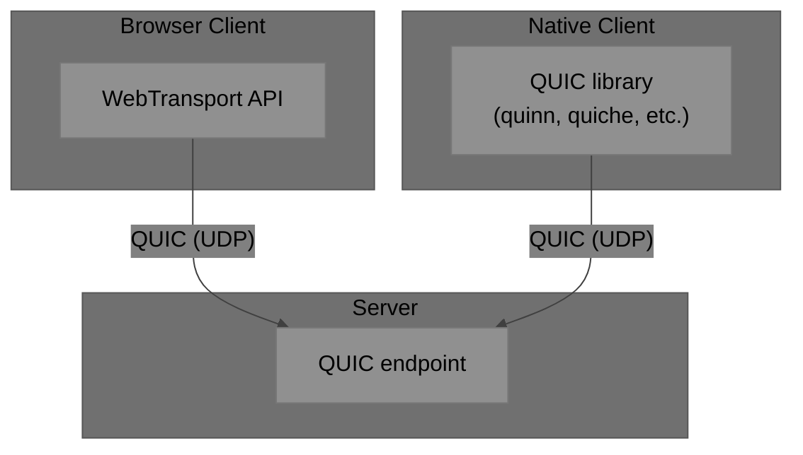

## Why QUIC?

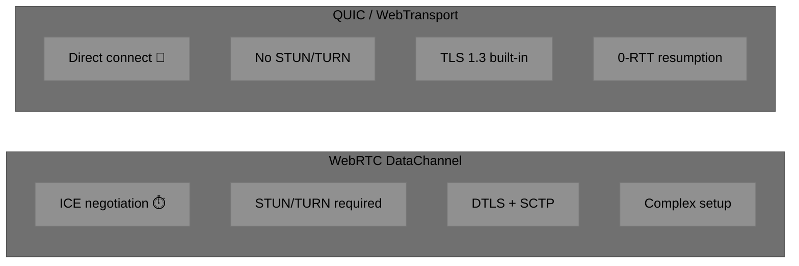

| Feature | WebRTC DC | QUIC/WebTransport | TCP/WebSocket |
|---------|-----------|-------------------|---------------|
| Transport | UDP (via SCTP) | UDP (native) | TCP |
| Encryption | DTLS | TLS 1.3 | TLS 1.2/1.3 |
| Setup latency | High (ICE+DTLS+SCTP) | 1-RTT (0-RTT on resume) | 1-RTT (TCP) + 1-RTT (TLS) |
| Stream multiplexing | Per-DataChannel | Per-stream (native) | None (single stream) |
| Head-of-line blocking | No (per-DC) | No (per-stream) | **Yes** (all channels) |
| NAT traversal | ICE/STUN/TURN | Direct (HTTP/3 ports) | Direct |
| Unreliable delivery | maxRetransmits=0 | Datagrams | Not possible |
| Connection migration | No | **Yes** (IP change survives) | No |
| 0-RTT resumption | No | **Yes** | No (TLS 1.3 partial) |
| Browser support | Universal | Chrome, Edge (Safari/Firefox WIP) | Universal |

## Architecture

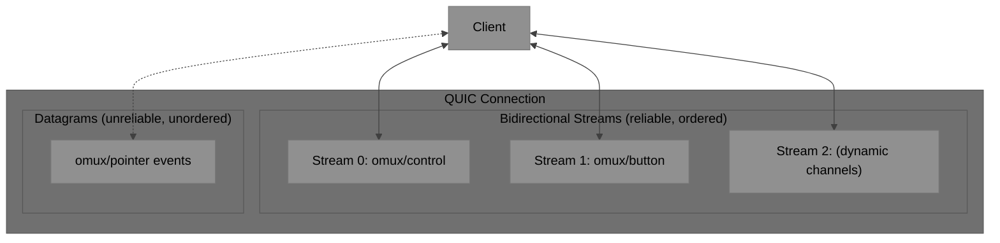

### Channel Mapping

QUIC provides two primitives that map perfectly to xumux:

| xumux Channel Property | QUIC Primitive | Mapping |
|--------------------------|---------------|---------|
| Reliable + Ordered | **Bidirectional Stream** | 1:1 — each channel gets its own QUIC stream |
| Unreliable + Unordered | **Datagram** | Channel byte in header disambiguates |

This is cleaner than WebRTC DataChannels because QUIC streams are lightweight (just a stream ID, no negotiation) and can be created/destroyed instantly.

### Stream Creation Rules

**Who opens which streams:**

1. The **client** opens the first bidirectional stream (stream 0) and sends HELLO on it. This is always the control channel.
2. After processing HELLO, the **server** opens bidirectional streams for each accepted reliable channel and includes `streamId` in WELCOME.
3. For dynamic channels (OPEN_CHANNEL after handshake), the **requesting side** opens the new QUIC stream, then sends OPEN_CHANNEL on the control stream. CHANNEL_ACK confirms with the `streamId`.

**Stream identification:** Before WELCOME is processed, the receiver cannot know which stream corresponds to which channel. Therefore:
- Stream 0 is **always** the control channel (by convention, like WebRTC's negotiated DataChannel ID 0).
- All other streams MUST include the correct Channel byte in the xumux frame header. The receiver uses the Channel byte to identify the channel, cross-referencing with the `streamId` mappings from WELCOME.
- If a frame arrives on an unknown stream with an unknown Channel byte, the receiver MUST send ERROR (code 4003, CHANNEL_NOT_FOUND) on the control stream.

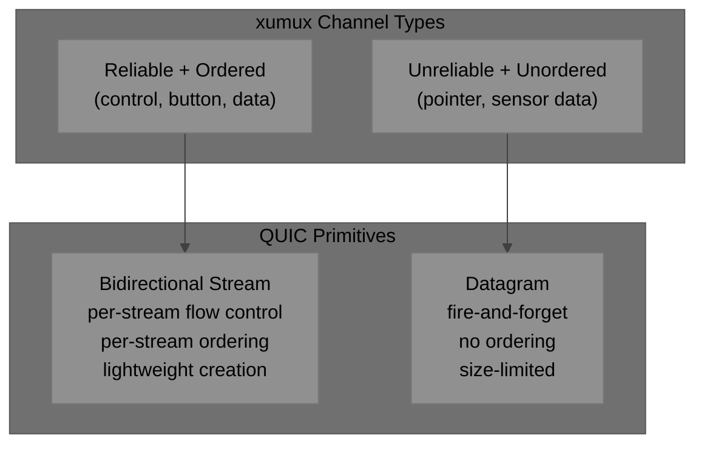

## Connection Flow

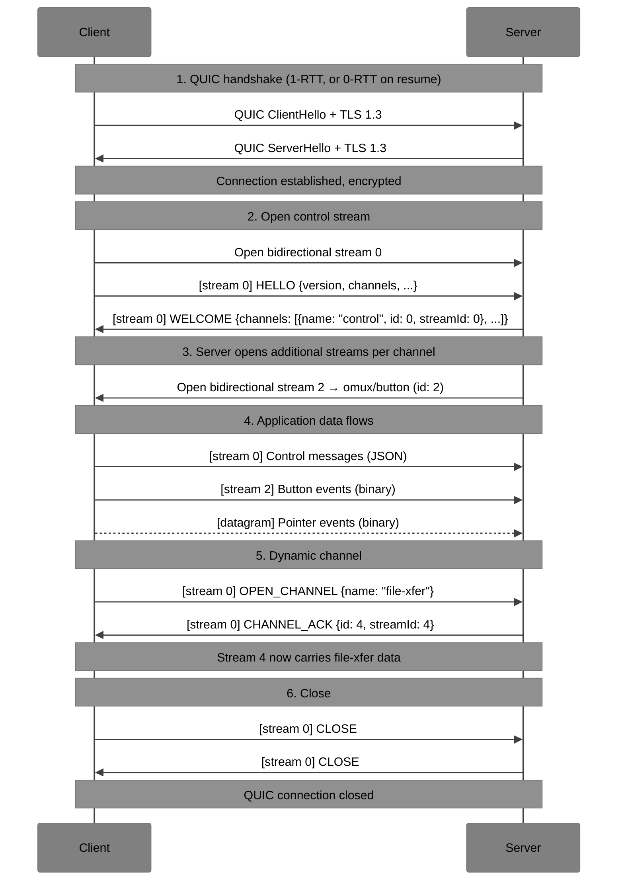

### 0-RTT Connection Resumption

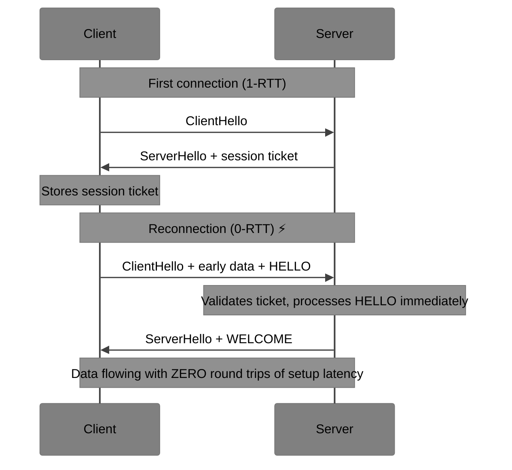

0-RTT is particularly valuable for VROOM-Graphical — reconnecting after a network glitch resumes the interactive session instantly.

**Security note**: 0-RTT data is replayable. xumux HELLO is idempotent, so this is safe. Application protocols MUST NOT send non-idempotent data in 0-RTT.

## WebTransport API Mapping

For browser clients using the WebTransport API:

```javascript
// Connect
const transport = new WebTransport("https://agent.example.com:4433/vroom");
await transport.ready;

// Control channel → bidirectional stream
const controlStream = await transport.createBidirectionalStream();
const controlWriter = controlStream.writable.getWriter();
const controlReader = controlStream.readable.getReader();

// Send HELLO on control stream
controlWriter.write(encodexumuxFrame(0, 0x01, helloPayload));

// Button channel → another bidirectional stream
const buttonStream = await transport.createBidirectionalStream();
const buttonWriter = buttonStream.writable.getWriter();

// Pointer channel → datagrams (unreliable)
const datagramWriter = transport.datagrams.writable.getWriter();
const datagramReader = transport.datagrams.readable.getReader();

// Send mouse move via datagram
datagramWriter.write(encodexumuxFrame(1, 0x01, mousePayload));

// Send key press via reliable stream
buttonWriter.write(encodexumuxFrame(2, 0x12, keyPayload));
```

### WebTransport ↔ xumux Mapping

| WebTransport Concept | xumux Concept |
|---------------------|-----------------|
| `createBidirectionalStream()` | Open reliable+ordered channel |
| `datagrams.writable` | Send on unreliable+unordered channel |
| `datagrams.readable` | Receive unreliable+unordered messages |
| Stream close | CLOSE_CHANNEL |
| `transport.close()` | CLOSE |
| Session ticket / 0-RTT | Reconnection (no xumux equivalent needed) |

## Frame Format

### On Streams (reliable channels)

Same as core xumux. Since QUIC streams are byte streams (like TCP), frames must be parsed using the Length field:

```
[Channel: 1][Type: 1][Flags: 1][Reserved: 1][Length: 2][Payload: variable]
```

Each QUIC stream carries one xumux channel. The Channel byte is redundant (the stream identity determines the channel) but MUST be present for cross-transport compatibility.

**Stream framing note**: Unlike WebSocket/DataChannel (which provide message boundaries), QUIC streams are byte streams. Implementations MUST parse frames by reading the 6-byte header, then reading exactly `Length` bytes of payload — identical to the TCP binding.

However, WebTransport's `readable`/`writable` streams in browsers operate on `Uint8Array` chunks, not raw bytes. Implementations SHOULD write one complete xumux frame per `write()` call and handle partial reads on the receive side.

### On Datagrams (unreliable channels)

QUIC datagrams are self-contained — each datagram is one complete message. The frame format is the same, but:

- Length field is redundant (datagram size is known) — MUST still be present
- EXTENDED_LENGTH MUST NOT be used (datagrams have a max size, typically ~1200 bytes)
- FRAGMENT flags MUST NOT be used (datagrams cannot be reassembled reliably)

```
One QUIC datagram = one xumux frame = one pointer/sensor event
```

Datagram max size depends on the QUIC path MTU. The server advertises `max_datagram_frame_size` during handshake. xumux pointer events are 10 bytes total (6 header + 4 payload), well within any MTU.

## Channel-to-Stream Assignment

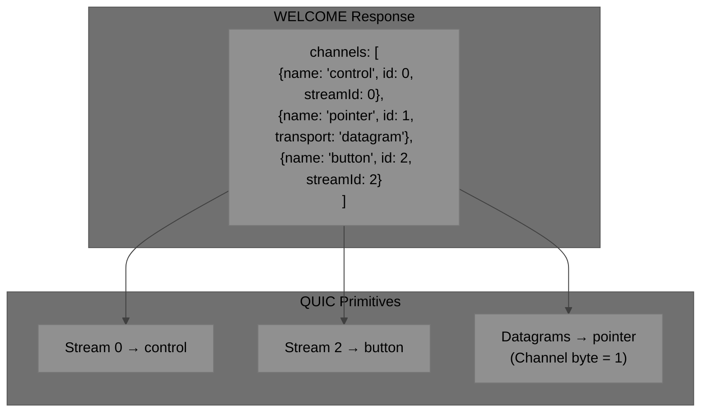

The WELCOME message in the QUIC binding adds two optional fields to each channel assignment:

| Field | Type | Description |
|-------|------|-------------|
| `streamId` | number | QUIC stream ID for this channel (reliable channels) |
| `transport` | `"stream"` \| `"datagram"` | Which QUIC primitive. Default: `"stream"` |

Channels with `"transport": "datagram"` share the datagram pipe and are disambiguated by the Channel byte in the xumux header.

## Dynamic Channels

Creating a new channel is simpler on QUIC than any other transport:

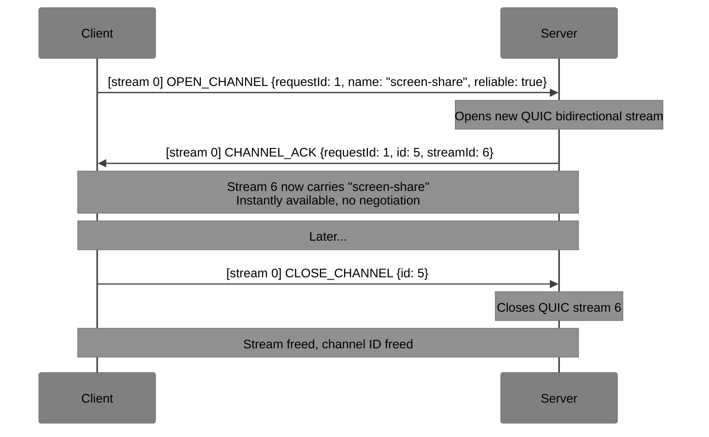

QUIC streams are cheap — creating one is just sending a frame with a new stream ID. No round-trip negotiation at the transport level. The OPEN_CHANNEL/CHANNEL_ACK round-trip is purely at the xumux level for both sides to agree on the channel semantics.

## Connection Migration

QUIC supports connection migration — if the client's IP address changes (e.g., switching from WiFi to cellular), the QUIC connection survives. This is transparent to xumux.

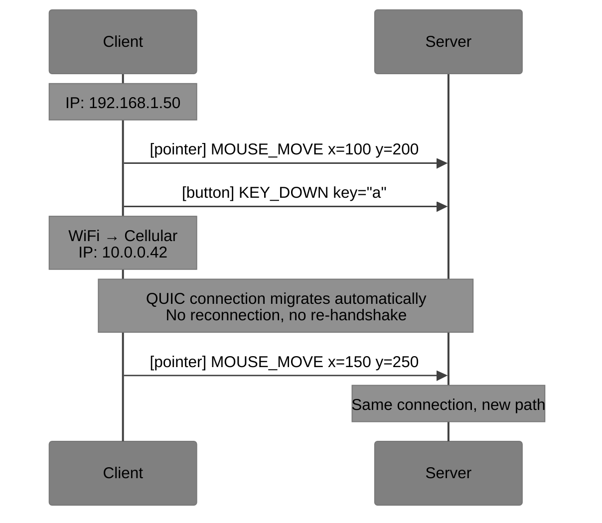

This is impossible with WebRTC DataChannels (requires ICE restart) and TCP/WebSocket (requires full reconnection + re-handshake).

## Endpoint Convention

WebTransport URLs use HTTPS:

```
https://host:port/omux
https://host:port/vroom
```

Default port: **4433** (common WebTransport convention) or **443** (shared with HTTPS).

WebTransport requires a valid TLS certificate (self-signed certificates can be allowed via `serverCertificateHashes` in the browser API).

## Server Requirements

- MUST support HTTP/3 (QUIC)
- MUST support WebTransport protocol negotiation
- MUST support bidirectional streams
- SHOULD support datagrams (for unreliable channels)
- If datagrams are not supported, unreliable channels fall back to streams (with a warning that ordering/reliability semantics change)
- MUST advertise supported xumux channels in WELCOME with stream/datagram assignments

## Client Requirements

- Browser clients MUST use the WebTransport API
- Native clients MAY use any QUIC library (quinn/Rust, quiche/C, aioquic/Python)
- Clients MUST handle datagram unavailability gracefully (fall back to streams)
- Clients SHOULD implement 0-RTT for fast reconnection

## Fallback Chain

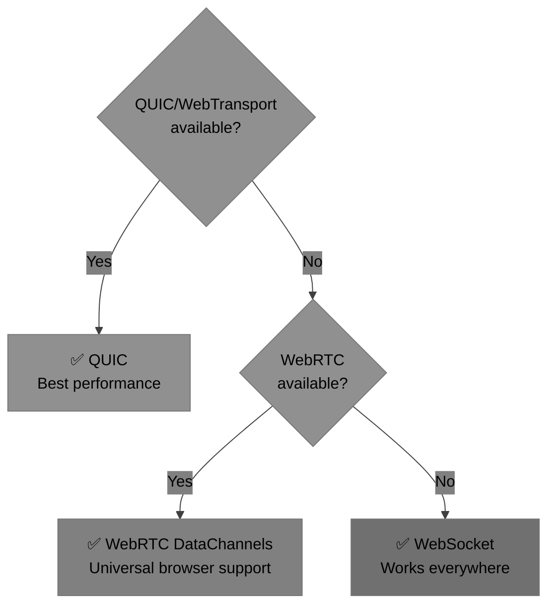

Recommended client behavior:
1. Try QUIC/WebTransport first (fastest setup, best performance)
2. Fall back to WebRTC DataChannels (universal browser support, NAT traversal)
3. Fall back to WebSocket (works through any proxy/firewall)

Timeout per attempt: **5 seconds** before trying next option.

## Security

- TLS 1.3 is mandatory in QUIC (encryption is not optional)
- Certificate validation follows standard HTTPS rules
- 0-RTT data is replayable — only idempotent messages (HELLO) should be sent in 0-RTT
- QUIC has built-in amplification attack mitigation (address validation)
- No additional encryption layer is needed

## Comparison: QUIC vs WebRTC for VROOM-Graphical

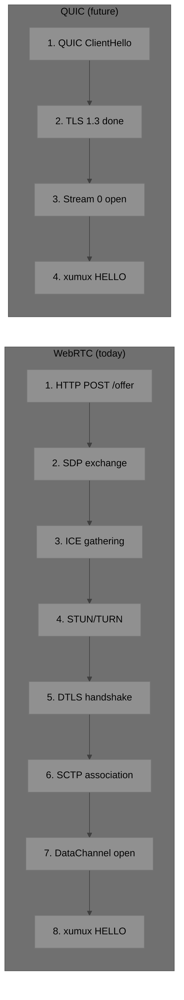

| Metric | WebRTC | QUIC |
|--------|--------|------|
| Setup round-trips | 3-5 | 1 (0 on resume) |
| Infrastructure needed | STUN + TURN servers | Just a server with a port |
| Connection migration | ICE restart (seconds) | Transparent (zero) |
| Stream creation cost | DataChannel negotiation | Just a new stream ID |
| Max concurrent streams | ~65535 DataChannels | ~2^62 streams |
| Datagram support | maxRetransmits=0 (hack) | Native QUIC datagrams |

**Bottom line**: QUIC is strictly superior. WebRTC remains the pragmatic choice today for browser reach. The xumux abstraction means applications don't need to change when migrating between them.
