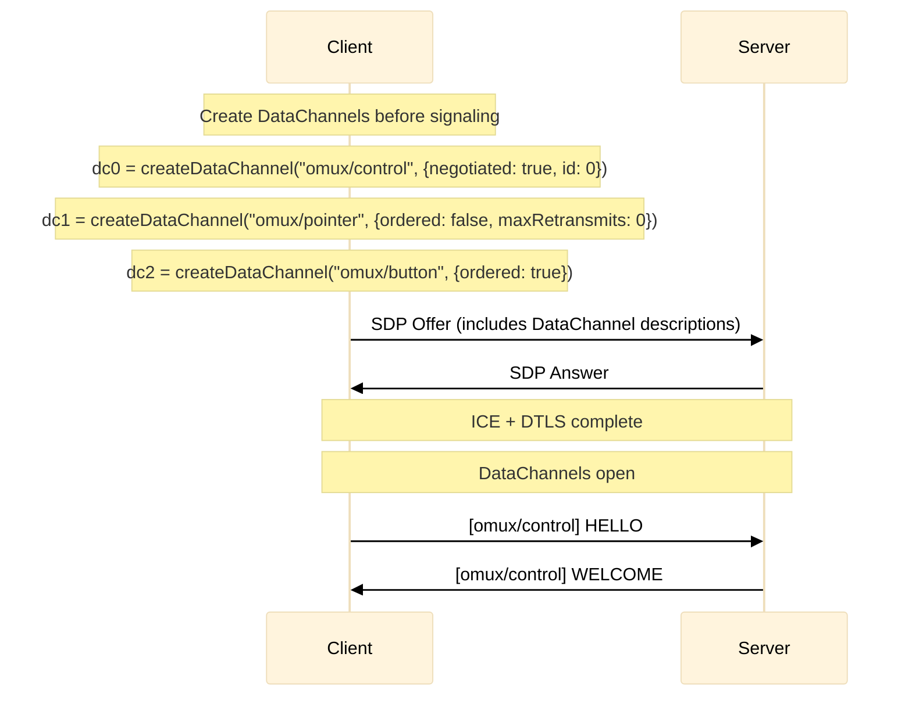

# xumux on WebRTC DataChannels

**Status**: Draft
**Binding ID**: `webrtc`

## Overview

This binding defines how xumux operates over WebRTC DataChannels. WebRTC is the **preferred transport** for xumux — it provides UDP-based low-latency delivery, built-in DTLS encryption, NAT traversal, and native support for multiple channels with independent reliability settings.

## Signaling

WebRTC requires a signaling phase to exchange SDP offers/answers and ICE candidates. xumux does not prescribe a specific signaling mechanism — any of the following work:

- **HTTP POST** — Client POSTs SDP offer, receives SDP answer (simplest)
- **WebSocket** — Ephemeral WebSocket for signaling, closed after DataChannels open
- **Out-of-band** — Pre-shared SDP, manual exchange, etc.

The signaling channel is **disposable**. Once DataChannels are established, no persistent signaling connection is required.

### Recommended: HTTP POST Signaling

```
Client                              Server
  │                                    │
  │── POST /offer {sdp, candidates} ──►│
  │                                    │
  │◄── 200 {sdp, candidates} ─────────│
  │                                    │
  │  ... DataChannels open ...         │
  │                                    │
  │  (no persistent HTTP/WS needed)    │
```

For trickle ICE, use:

```
POST /offer     → SDP offer/answer exchange
POST /candidate → Individual ICE candidates (optional)
```

### Signaling Message Format

**POST /offer** (client → server):

```http
POST /offer HTTP/1.1
Content-Type: application/json

{
  "sdp": "v=0\r\no=- ...",
  "type": "offer",
  "candidates": [
    {"candidate": "candidate:...", "sdpMid": "0", "sdpMLineIndex": 0}
  ]
}
```

**Response** (server → client):

```http
HTTP/1.1 200 OK
Content-Type: application/json

{
  "sdp": "v=0\r\no=- ...",
  "type": "answer",
  "candidates": [
    {"candidate": "candidate:...", "sdpMid": "0", "sdpMLineIndex": 0}
  ]
}
```

**POST /candidate** (trickle ICE, both directions — client POST, server SSE or poll):

```http
POST /candidate HTTP/1.1
Content-Type: application/json

{
  "candidate": "candidate:...",
  "sdpMid": "0",
  "sdpMLineIndex": 0
}
```

The `candidates` array in `/offer` allows bundling all gathered candidates with the offer for a single-round-trip exchange (non-trickle). If the array is empty or omitted, trickle ICE via `/candidate` is expected.

## Channel Mapping

Each xumux channel maps to a dedicated WebRTC DataChannel. This provides true independent reliability and ordering per channel, enforced by the transport itself.

| xumux Channel | DataChannel Label | Ordered | Reliable | MaxRetransmits |
|-----------------|-------------------|---------|----------|----------------|
| 0 (control) | `omux/control` | Yes | Yes | — |
| Application-defined | `omux/<name>` | Per-channel | Per-channel | Per-channel |

### DataChannel Creation

The **client** creates all DataChannels:

1. Before sending HELLO, the client creates DataChannels for all channels listed in HELLO, plus `omux/control`.
2. The client uses **negotiated DataChannel IDs** for the control channel to avoid races:
   - `omux/control`: `{negotiated: true, id: 0}` — both sides pre-agree on ID 0.
3. Application DataChannels MAY use auto-assigned IDs (non-negotiated).
4. For dynamic channels (OPEN_CHANNEL after handshake), the requesting side creates the DataChannel, then sends OPEN_CHANNEL. The CHANNEL_ACK confirms the other side has accepted it.



If a DataChannel closes unexpectedly (e.g., SCTP reset by the browser), the side that detects the closure MUST send CLOSE_CHANNEL on the control channel to notify the peer. If `omux/control` itself closes unexpectedly, the connection is considered dead — both sides MUST close the PeerConnection.

### DataChannel Label Convention

```
omux/<channel-name>
```

Examples:
- `omux/control` — always present
|- `omux/pointer` — VROOM-Graphical mouse movement (unreliable, unordered)
|- `omux/button` — VROOM-Graphical clicks/keys (reliable, ordered)
|- `omux/data` — VROOM-Terminal terminal data (reliable, ordered)

### DataChannel Protocol

All DataChannels MUST set their protocol to:

```
xumux/0.1
```

### Channel ID Assignment

When using WebRTC, the Channel byte in the xumux frame header maps to the DataChannel. Since each DataChannel is already a separate stream, the Channel byte is technically redundant but MUST still be present for cross-transport compatibility.

In practice, implementations MAY use the DataChannel label to identify the channel and ignore the Channel byte, but MUST write it correctly for interoperability with gateways that bridge between transports.

## Frame Format

Identical to core xumux. Each DataChannel message is one complete xumux frame:

```
[Channel: 1][Type: 1][Flags: 1][Reserved: 1][Length: 2][Payload: variable]
```

DataChannel messages are already framed by SCTP, so no additional length-prefix or delimiter is needed at the transport level.

## Reliability Configuration

WebRTC DataChannels support three reliability modes:

| Mode | Configuration | Use Case |
|------|--------------|----------|
| Reliable + Ordered | `ordered: true` (default) | Control, keyboard, clicks |
| Reliable + Unordered | `ordered: false` | Bulk data where order doesn't matter |
| Unreliable + Unordered | `maxRetransmits: 0, ordered: false` | Mouse movement, sensor data |
| Semi-reliable | `maxRetransmits: N` or `maxPacketLifeTime: ms` | Video frames, audio |

Application protocols specify which mode each channel uses.

## Coexistence with Media Tracks

WebRTC PeerConnections can carry both DataChannels and media tracks (audio/video) simultaneously. xumux DataChannels coexist with media tracks in the same PeerConnection:

```
PeerConnection
├── MediaTrack: video (H264/VP9)     ← video output
├── MediaTrack: audio (Opus)         ← voice I/O
├── DataChannel: omux/control        ← xumux control
├── DataChannel: omux/pointer        ← xumux mouse
└── DataChannel: omux/button         ← xumux keyboard/clicks
```

One SDP negotiation, one ICE dance, one DTLS handshake. The DataChannels ride alongside media at zero extra connection cost.

## Connection Lifecycle

```
1. Signaling (ephemeral HTTP or WS):
   a. Exchange SDP offer/answer (includes DataChannel + media descriptions)
   b. Exchange ICE candidates
   c. Signaling channel may close

2. DTLS handshake completes

3. DataChannels open:
   a. omux/control opens first
   b. xumux HELLO/WELCOME exchanged on omux/control
   c. Application channels open per WELCOME

4. Application data flows over DataChannels
   Media flows over media tracks (if present)

5. Close:
   a. CLOSE on omux/control
   b. PeerConnection closed
```

## Fallback

If WebRTC negotiation fails (ICE timeout, firewall, no TURN server), implementations SHOULD fall back to the WebSocket binding. The application protocol is identical — only the transport changes.

Recommended timeout: **10 seconds** from SDP exchange to first DataChannel open.

## Security

- All DataChannels are encrypted via DTLS (mandatory in WebRTC spec)
- TURN credentials MUST be short-lived and scoped per session
- Servers SHOULD validate that the signaling identity matches the DTLS peer
- No additional encryption layer is needed

## SCTP Considerations

- Default SCTP message size limit is ~256KB (browser-dependent)
- For larger payloads, use the EXTENDED_LENGTH flag and chunk at the application layer
- SCTP congestion control is automatic — no manual flow control needed for most use cases
